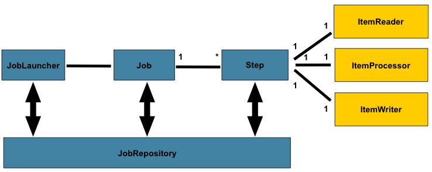
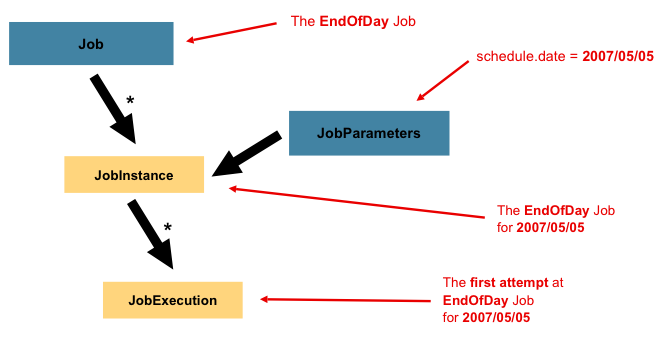
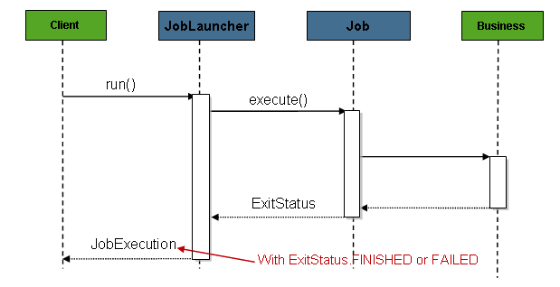
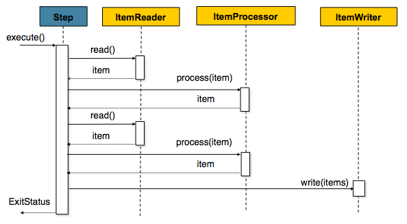

<!--

Licensed to the Apache Software Foundation (ASF) under one or more
contributor license agreements.  See the NOTICE file distributed with
this work for additional information regarding copyright ownership.
The ASF licenses this file to you under the Apache License, Version 2.0
(the "License"); you may not use this file except in compliance with
the License.  You may obtain a copy of the License at

http://www.apache.org/licenses/LICENSE-2.0

Unless required by applicable law or agreed to in writing, software
distributed under the License is distributed on an "AS IS" BASIS,
WITHOUT WARRANTIES OR CONDITIONS OF ANY KIND, either express or implied.
See the License for the specific language governing permissions and
limitations under the License.

-->

# Ambari Infra Manager

## Overview

Ambari Infra Manager is a REST based management application for Ambari Infra services (like Infra Solr). The API is built on top of [Spring Batch](http://docs.spring.io/spring-batch/reference/html/)

### Architecture


### Job execution overview


### Job workflow


### Step workflow


(images originally from [here](http://docs.spring.io/spring-batch/reference/html/))

## API documentation

Infra Manager uses [Swagger](http://swagger.io/), generated yaml file can be downloaded from [here](docs/api/swagger.yaml)


## Development guide

### Adding a new custom job

As Infra Manager is a Spring based application and using Java configurations, if it is needed to add a new custom Job, the Jobs/Steps/Configurations are need to be on the classpath. Spring beans are registered only in a specific package, so for writing a plugin, all the added Java classes needs to be added inside "org.apache.ambari.infra" package.

For the plugin it will be needed to add all Spring & Spring batch dependencies. For adding a new Job you will need to define a new Configuration object. There you can define your own jobs/steps/writers/readers/processors, as you can see in that example:
```java
@Configuration
@EnableBatchProcessing
public class MyJobConfig {

  @Inject
  private StepBuilderFactory steps;

  @Inject
  private JobBuilderFactory jobs;
  
  
  @Bean(name = "dummyStep")
  protected Step dummyStep(ItemReader<DummyObject> reader,
                         ItemProcessor<DummyObject, String> processor,
                         ItemWriter<String> writer) {
    return steps.get("dummyStep").listener(new DummyStepListener()).<DummyObject, String> chunk(2)
      .reader(reader).processor(processor).writer(writer).build();
  }
  
  @Bean(name = "dummyJob")
  public Job job(@Qualifier("dummyStep") Step dummyStep) {
    return jobs.get("dummyJob").listener(new DummyJobListener()).start(dummyStep).build();
  }

}
```
As you can see it will require to implement [ItemWriter](https://docs.spring.io/spring-batch/apidocs/org/springframework/batch/item/ItemWriter.html), [ItemReader](http://docs.spring.io/spring-batch/trunk/apidocs/org/springframework/batch/item/ItemReader.html) and [ItemProcessor](https://docs.spring.io/spring-batch/apidocs/org/springframework/batch/item/ItemProcessor.html)

### Schedule custom jobs

It can be needed based on business requirements to schedule jobs (e.g. daily) instead of run manually through the REST API. It can be done with adding a custom bean to "org.apache.ambari.infra" package with using [@Scheduled](http://docs.spring.io/spring-framework/docs/current/javadoc-api/org/springframework/scheduling/annotation/Scheduled.html):
```java
@Named
public class MySchedulerObject {

   @Inject
   private JobService jobService; // or JobOperator jobOperator if spring-batch-admin manager dependecy is not included
   
   @Value("${infra-manager.batch.my.param:defaultString}")
   private String myParamFromLogSearchProperties;
   
   @Scheduled(cron = "*/5 * * * * MON-FRI")
   public void doSomething() {
      // setup job params
      jobService.launch(jobName, jobParameters, TimeZone.getDefault());
   }
   
   @Scheduled(cron = "${infra.manager.my.prop}")
   public void doSomethingBasedOnInfraProperty() {
      // do something ...
   }
}
```

You can put your cron expression inside infra-manager.properties file just make it configuratble.
### Build & Run Application
```bash
mvn clean package exec:java
```

### Build & Run Application in docker container
```bash
cd docker
./infra-manager-docker.sh
```