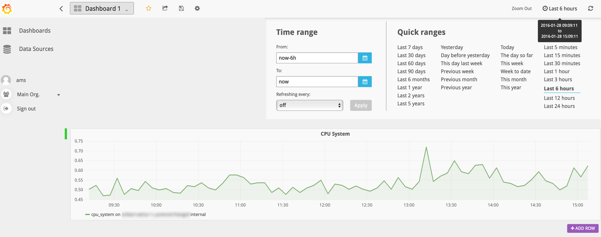

<!--
  ~ Licensed to the Apache Software Foundation (ASF) under one
  ~ or more contributor license agreements.  See the NOTICE file
  ~ distributed with this work for additional information
  ~ regarding copyright ownership.  The ASF licenses this file
  ~ to you under the Apache License, Version 2.0 (the
  ~ "License"); you may not use this file except in compliance
  ~ with the License.  You may obtain a copy of the License at
  ~
  ~     http://www.apache.org/licenses/LICENSE-2.0
  ~
  ~ Unless required by applicable law or agreed to in writing, software
  ~ distributed under the License is distributed on an "AS IS" BASIS,
  ~ WITHOUT WARRANTIES OR CONDITIONS OF ANY KIND, either express or implied.
  ~ See the License for the specific language governing permissions and
  ~ limitations under the License.
  -->
# AMS (Ambari Metrics Service) Datasource Plugin for Grafana

Use **ambari-metrics** to visualize metrics exposed via AMS in Grafana. 

### If you already have Ambari Metrics UI as a part of your AMS Install, [go here](#createdash) to get started


**ToC**
 - [Install Grafana](#installg)
 - [Install Datasource Plugin](#installam)
 - [Access Grafana](#accessgraf)
 - [Add Datasource to Grafana](#addds)
  	- [Test Datasource](#testds)
 - [Create Dashboard](#createdash)
 - [Add a Graph](#addgraph)
 - [Save Dashboard](#savedash)
 - [Time Ranges](#timerange)
 - [Edit Panel/Graph](#editpanel)
 - [Templated Dashboards](#templating)
    - [Multi Host Templated Dashboards](#multi-templating)


----------


----------
<a name="installg"></a>
### Install Grafana


You can install Grafana on any host.  It does not need to be co-located with Ambari Metrics Collector.  The only requirement is that it has network access to Ambari Metrics Collector.

**Install on CentOS/Red Hat:**
```
sudo yum install https://grafanarel.s3.amazonaws.com/builds/grafana-2.6.0-1.x86_64.rpm
```

**Install on Ubuntu/Debian:**
```
wget https://grafanarel.s3.amazonaws.com/builds/grafana_2.6.0_amd64.deb
sudo apt-get install -y adduser libfontconfig
sudo dpkg -i grafana_2.6.0_amd64.deb
```

**Install on SUSE/SLES:**
```
sudo rpm -i --nodeps grafana-2.6.0-1.x86_64.rpm
```
<a name="installam"></a> 
### Deploy ambari-metrics 

**On your Grafana Server**

```
cp -R ambari/ambari-metrics/ambari-metrics-grafana/ambari-metrics /usr/share/grafana/public/app/plugins/datasource
```

### Start Grafana

```
sudo service grafana-server start
```

<a name="accessgraf"></a> 
### Access Grafana

```
http://GRAFANA_HOST:3000 
```

---

<a name="addds"></a>
## Add Ambari Metrics Datasource in Grafana UI

**Add a Datasource**
>	- Click on "Datasources"
> 	- Click on "Add New" at the top 


**Add a Datasource (continued)**

> 	1. Name of your Datasource
>	2. Type = AmbariMetrics
> 	3. Host+Port of your AMS installation. (usually host:6188) 
>  		- No trailing slashes
> 		- Nothing else needs to be changed
>  		- Click on Save.


<a name="testds"></a>
**Test your Datasource**

>	To make sure it's all working, click on **Test Connection** and you should see a message that says "Data source is working". 


---

<a name="createdash"></a>
## Creating a Dashboard

**To create a dashboard**

>	- Click on Dashboards on the left
>	- Click on "Home"
>	- Click on New at the bottom of the dropdown 


**To add a panel to your newly created dashboard**

>	- Click on the green button on the left(see image below)
>	- This will expand a flyout menu that will allow you to add a panel
>	- Choose Graph / Table / Single Stat


---

<a name="addgraph"></a>
**To add a Graph**


>	- Choose the Datasource you created earlier
>	- Once you've chosen the datasource, you should see the query editor show you some options


>	- Choose the component you wish to see metrics for


>	- Based on the component chosen, you should now see a list of metrics for it


>	- Choose hostname from the list of hosts if you wish to see metrics for a specific host.
>		- if hostname isn't chosen, metrics will be shown on a service component level. 


> 	- By default the aggregator is avg. You can change it via the dropdown
> 	- You can choose to enable Rate by selecting the checkbox.
> 	- You can specify precision by checking the box and then selecting "days, hours, minutes or seconds"


**To change the title of the Panel**

>	- Click on the "General" tab
>	- Enter the name to change the title of the panel


**To change the Units for your metric**

>	- You can edit the units of your graph by clicking on **Axes & Grid** tab and clicking on "unit" as shown.


**To customise your graphs**

> 	- You can customise your graph by clicking on the **Display Styles** tab.
> 	- For ex: you can change the color of a specific metric by choosing a series specific override at the bottom.


<a name="savedash"></a>
**To Save the Dashboard**

> 	- Click on the save icon next to the dashboard list dropdown on the top to save your dashboard.


<a name="editpanel"></a>
**To Edit a Graph**

> 	- Click on the title of your graph/panel and click on edit.


---
<a name="timerange"></a>
### Time Ranges

**To change the Time Range**

>	- To change the timerange click on the top right of your UI.
>		- This setting affects all your graphs inside the dashboard. If you wish to customise time for a specific graph [look here](#timeshift)
> 	- You can use the quick ranges provided or choose a time range of your choice. You can also choose a refresh duration for your dashboard or leave it at "off" to manually refresh.



<a name="timeshift"></a>
**To change the time range of one graph only**

>	- Use this in case you wish to change the time range for a specific graph without affecting the other graphs in your dashboard
>		- Click on the **Time Range** tab of your Graph
>		- You can then enter a value in the "Override Relative time" input box
>		- You will be able to confirm that this change has occured by looking at the top right of your graph which will show the override message.
>		- You can choose to hide this message if you wish to do so (by checking the "hide time override info")


---

<a name="templating"></a>
### Templating

**Templating allows you to dynamically change graphs by selecting your host from dropdown. To created a templated dashboard, you can follow these steps.**

> 1. Click on the "cog" on the top, select "Templating"
> 2. Click on "+ New"
> 3. Enter a name for your variable. Ex: "hosts".
> 4. Type: query
> 5. Datasource: This should be set to the name you had chosen for your Datasource. Default is "AMBARI_METRICS"
> 6. Query: This needs to be "hosts". It is case sensitive as well.
> 7. Once you've entered the query and you focus your cursor anywhere else, you should see the "Preview of values" updated with the hostnames in your cluster.
> 8. You can close the Templating Variables section.
> 9. You should now have a dropdown on your dashboard with hosts from your cluster.
> 10. When you now add a graph, and select your component and metric, the plotted graph will show you metrics for the selected hostname from the dropdown.
> 11. The legend on the graph will also now update with the selected host.

**Templated dashboards do support multiple metrics in a single graph.** 


---

<a name="multi-templating"></a>
### Multi Host Templated Dashboards.

**Templated dashboards now have the ability to filter graphs based on a single host or multiple hosts.**

> 1. Once you've created your templated dashboard, you can edit it gain by clicking on the "cog" on the top, select "Templating".
> 2. Click on "Edit" for your templating variable.
> 3. To be able to select Multiiple Hosts, set multi-value selection to "enable" and leave multi-format set to "glob".
> 4. To have an option for All hosts, select All Value, and set it to "*" and All format to "wildcard".
> 5. Hit Update and close the templating variables options and you should be now able to select multiple hosts from the dropdown (or "all" hosts at once.)


