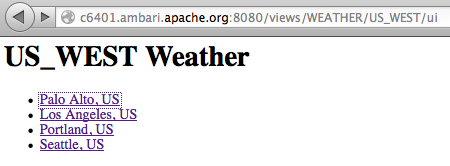
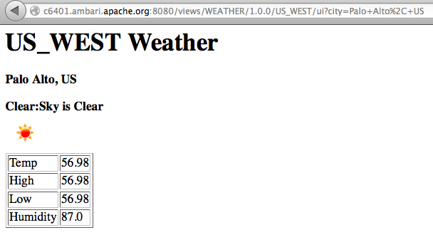

<!---
Licensed to the Apache Software Foundation (ASF) under one or more
contributor license agreements.  See the NOTICE file distributed with
this work for additional information regarding copyright ownership.
The ASF licenses this file to You under the Apache License, Version 2.0
(the "License"); you may not use this file except in compliance with
the License.  You may obtain a copy of the License at [http://www.apache.org/licenses/LICENSE-2.0](http://www.apache.org/licenses/LICENSE-2.0)

Unless required by applicable law or agreed to in writing, software
distributed under the License is distributed on an "AS IS" BASIS,
WITHOUT WARRANTIES OR CONDITIONS OF ANY KIND, either express or implied.
See the License for the specific language governing permissions and
limitations under the License.
-->

Weather View Example
========
Description
-----
The Weather view demonstrates the the use of instance parameters, a servlet for a dynamic UI and a managed resource.  The Weather view displays the weather for various cites around the world.  Unlike the calculator resource in the example [Calculator View](calculator-view/docs/index.md), the Weather view's city resources are managed by Ambari.  This means that they are accessed through a user defined resource provider and plugged into Ambari's REST API as subresources of the view instance.

Package
-----

All views are packaged as a view archive.  The view archive contains the configuration file and various optional components of the view.

#####view.xml

The view.xml file is the only required file for a view archive.  The view.xml is the configuration that describes the view and view instances for Ambari.

      <view>
        <name>WEATHER</name>
        <label>Weather</label>
        <version>1.0.0</version>
        <parameter>
          <name>cities</name>
          <description>The list of cities.</description>
          <required>true</required>
        </parameter>
        <parameter>
          <name>units</name>
          <description>The units (metric or imperial).</description>
          <required>false</required>
        </parameter>
        <resource>
          <name>city</name>
          <plural-name>cities</plural-name>
          <id-property>id</id-property>
          <resource-class>org.apache.ambari.view.weather.CityResource</resource-class>
          <provider-class>org.apache.ambari.view.weather.CityResourceProvider</provider-class>
          <service-class>org.apache.ambari.view.weather.CityService</service-class>
        </resource>
        <instance>
          <name>US_WEST</name>
          <property>
            <key>cities</key>
            <value>Palo Alto, US;Los Angeles, US;Portland, US;Seattle, US</value>
          </property>
          <property>
            <key>units</key>
            <value>imperial</value>
          </property>
        </instance>
        <instance>
          <name>US_EAST</name>
          <property>
            <key>cities</key>
            <value>New York, US;Boston, US;Philadelphia, US;Atlanta, US</value>
          </property>
          <property>
            <key>units</key>
            <value>imperial</value>
          </property>
        </instance>
        <instance>
          <name>US_CENTRAL</name>
          <property>
            <key>cities</key>
            <value>Chicago, US;Dallas, US</value>
          </property>
          <property>
            <key>units</key>
            <value>imperial</value>
          </property>
        </instance>
        <instance>
          <name>US_MOUNTAIN</name>
          <property>
            <key>cities</key>
            <value>Denver, US;Phoenix, US</value>
          </property>
          <property>
            <key>units</key>
            <value>imperial</value>
          </property>
        </instance>
        <instance>
          <name>EUROPE</name>
          <property>
            <key>cities</key>
            <value>London, UK;Paris;Munich</value>
          </property>
          <property>
            <key>units</key>
            <value>imperial</value>
          </property>
        </instance>
      </view>

The configuration in this case defines a view named WEATHER that has a multiple instances.  You can see that the view includes a required parameter called **'cities'** and an optional parameter called **'units'**.  The view also contains an entry for a managed resource named **'city'**.  Because the resource is managed by Ambari, it is accessible as a sub-resource of the view instance through the Ambari REST API.

#####WEB-INF/web.xml
The web.xml is the deployment descriptor used to deploy the view as a web app.  The Java EE standards apply for the descriptor.  We can see that for this example a single servlet named **WeatherServlet** is mapped to the context path **'/ui'**.

      <servlet>
        <servlet-name>WeatherServlet</servlet-name>
        <servlet-class>org.apache.ambari.view.weather.WeatherServlet</servlet-class>
      </servlet>
      <servlet-mapping>
        <servlet-name>WeatherServlet</servlet-name>
        <url-pattern>/ui</url-pattern>
      </servlet-mapping>

#####WeatherServlet.java

The servlet WeatherServlet will be deployed as part of the view and mapped as described in the web.xml.

Notice that we can access the view context in the servlet by obtaining it as a servlet context attribute in the init() method.

      private ViewContext viewContext;

      @Override
      public void init(ServletConfig config) throws ServletException {
        super.init(config);

        ServletContext context = config.getServletContext();
        viewContext = (ViewContext) context.getAttribute(ViewContext.CONTEXT_ATTRIBUTE);
      }

The doGet() method of the servlet accesses the view context and the CityResourceProvider to display the list of cities available through the current view instance and detailed weather information for any select city.

      protected void doGet(HttpServletRequest request, HttpServletResponse response) throws IOException
      {
        ...

        String targetCity = request.getParameter("city");

        if (targetCity == null) {
          Map<String, String> properties = viewContext.getProperties();

          String   cityStr = properties.get("cities");
          String[] cities  = cityStr.split(";");
          
          // list the cities for this view instance
          for (String city : cities) {
            // write city info ...
          }
        } else {
          // Use the view's resource provider to get the specified city resource...
          ResourceProvider resourceProvider = viewContext.getResourceProvider("city");
          CityResource resource = 
              (CityResource) resourceProvider.getResource(targetCity, Collections.singleton("weather"));
          // write the specific city weather details ...
        }
      }

#####CityResource.java

 The CityResource class is a JavaBean that contains the attributes of a city resource for the Weather view.

      public class CityResource {

        private String id;

        private Map<String, Object> weather;

        private String units;

        public String getId() {
          return id;
        }

        public void setId(String id) {
          this.id = id;
        }
        ...
      }

#####CityResourceProvider.java

The CityResourceProvider class is an implementation of the ResourceProvider interface that provides access to city resources for the Ambari API framework.

      public class CityResourceProvider implements ResourceProvider<CityResource> {
        @Inject
        ViewContext viewContext;

        @Override
        public CityResource getResource(String resourceId, Set<String> propertyIds) throws
            SystemException, NoSuchResourceException, UnsupportedPropertyException {

          Map<String, String> properties = viewContext.getProperties();

          String units = properties.get("units");

          try {
            return getResource(resourceId, units, propertyIds);
          } catch (IOException e) {
            throw new SystemException("Can't get city resource " + resourceId + ".", e);
          }
        }
        ...
      }

#####CityService.java

The CityService uses JAX-RS annotations to define the actions to get the city resources.  Note that the injected ViewResourceHandler is used to pass control to the API framework.

      @Inject
      ViewResourceHandler resourceHandler;

      @GET
      @Path("{cityName}")
      @Produces({"text/plain", "application/json"})
      public Response getCity(@Context HttpHeaders headers, @Context UriInfo ui,
                              @PathParam("cityName") String cityName) {
        return resourceHandler.handleRequest(headers, ui, cityName);
      }

      @GET
      @Produces({"text/plain", "application/json"})
      public Response getCities(@Context HttpHeaders headers, @Context UriInfo ui) {
        return resourceHandler.handleRequest(headers, ui, null);
      }

Build
-----

The view can be built as a maven project.

    cd ambari-views/examples/weather-view
    mvn clean package

The build will produce the view archive.

    ambari-views/examples/weather-view/target/weather-view-1.0.0.jar

Deploy
-----
To deploy a view we simply place the view archive in the views folder of the ambari-server machine.  By default the views folder is located at ...

    /var/lib/ambari-server/resources/views

To deploy the Weather view simply copy the weather-view jar to the ambari-server views folder and restart the ambari server.

Use
-----

After deploying a view you should see it as a view resource in the Ambari REST API.  If we request all views, we should see the WEATHER view.

      http://<server>:8080/api/v1/views

      {
        "href" : "http://<server>:8080/api/v1/views",
        "items" : [
          {
            "href" : "http://<server>:8080/api/v1/views/CALCULATOR",
            "ViewInfo" : {
              "view_name" : "CALCULATOR"
            }
          },
          {
            "href" : "http://<server>:8080/api/v1/views/HELLO_SERVLET",
            "ViewInfo" : {
              "view_name" : "HELLO_SERVLET"
            }
          },
          {
            "href" : "http://<server>:8080/api/v1/views/HELLO_WORLD",
            "ViewInfo" : {
              "view_name" : "HELLO_WORLD"
            }
          },
          {
            "href" : "http://<server>:8080/api/v1/views/WEATHER",
            "ViewInfo" : {
              "view_name" : "WEATHER"
            }
          }
        ]
      }

If we want to see the details about a specific view, we can ask for it by name.  This shows us that the WEATHER view has multiple parameters and multiple instances.

    http://<server>:8080/api/v1/views/WEATHER/versions/1.0.0
    
    {
      "href" : "http://<server>:8080/api/v1/views/WEATHER/versions/1.0.0",
      "ViewVersionInfo" : {
        "archive" : "/var/lib/ambari-server/resources/views/work/WEATHER{1.0.0}",
        "label" : "Weather",
        "parameters" : [
          {
            "name" : "cities",
            "description" : "The list of cities.",
            "required" : true
          },
          {
            "name" : "units",
            "description" : "The units (metric or imperial).",
            "required" : false
          }
        ],
        "version" : "1.0.0",
        "view_name" : "WEATHER"
      },
      "instances" : [
        {
          "href" : "http://<server>:8080/api/v1/views/WEATHER/versions/1.0.0/instances/EUROPE",
          "ViewInstanceInfo" : {
            "instance_name" : "EUROPE",
            "version" : "1.0.0",
            "view_name" : "WEATHER"
          }
        },
        {
          "href" : "http://<server>:8080/api/v1/views/WEATHER/versions/1.0.0/instances/US_CENTRAL",
          "ViewInstanceInfo" : {
            "instance_name" : "US_CENTRAL",
            "version" : "1.0.0",
            "view_name" : "WEATHER"
          }
        },
        {
          "href" : "http://<server>:8080/api/v1/views/WEATHER/versions/1.0.0/instances/US_EAST",
          "ViewInstanceInfo" : {
            "instance_name" : "US_EAST",
            "version" : "1.0.0",
            "view_name" : "WEATHER"
          }
        },
        {
          "href" : "http://<server>:8080/api/v1/views/WEATHER/versions/1.0.0/instances/US_MOUNTAIN",
          "ViewInstanceInfo" : {
            "instance_name" : "US_MOUNTAIN",
            "version" : "1.0.0",
            "view_name" : "WEATHER"
          }
        },
        {
          "href" : "http://<server>:8080/api/v1/views/WEATHER/versions/1.0.0/instances/US_WEST",
          "ViewInstanceInfo" : {
            "instance_name" : "US_WEST",
            "version" : "1.0.0",
            "view_name" : "WEATHER"
          }
        }
      ]
    }
    
To see a specific instance of a view, we can ask for it by name.  Here we can see the attributes of the view including its name and root context path.  We can also see that this view instance defines a value for the name property.

    http://<server>:8080/api/v1/views/WEATHER/versions/1.0.0/instances/US_WEST

    {
      "href" : "http://<server>:8080/api/v1/views/WEATHER/versions/1.0.0/instances/US_WEST",
      "ViewInstanceInfo" : {
        "context_path" : "/views/WEATHER/1.0.0/US_WEST",
        "instance_name" : "US_WEST",
        "version" : "1.0.0",
        "view_name" : "WEATHER",
        "instance_data" : { },
        "properties" : {
          "cities" : "Palo Alto, US;Los Angeles, US;Portland, US;Seattle, US",
          "units" : "imperial"
        }
      },
      "resources" : [ ],
      "cities" : [
        {
          "href" : "http://<server>:8080/api/v1/views/WEATHER/versions/1.0.0/instances/US_WEST/cities/Los Angeles, US",
          "id" : "Los Angeles, US",
          "instance_name" : "US_WEST",
          "version" : "1.0.0",
          "view_name" : "WEATHER"
        },
        {
          "href" : "http://<server>:8080/api/v1/views/WEATHER/versions/1.0.0/instances/US_WEST/cities/Palo Alto, US",
          "id" : "Palo Alto, US",
          "instance_name" : "US_WEST",
          "version" : "1.0.0",
          "view_name" : "WEATHER"
        },
        {
          "href" : "http://<server>:8080/api/v1/views/WEATHER/versions/1.0.0/instances/US_WEST/cities/Portland, US",
          "id" : "Portland, US",
          "instance_name" : "US_WEST",
          "version" : "1.0.0",
          "view_name" : "WEATHER"
        },
        {
          "href" : "http://<server>:8080/api/v1/views/WEATHER/versions/1.0.0/instances/US_WEST/cities/Seattle, US",
          "id" : "Seattle, US",
          "instance_name" : "US_WEST",
          "version" : "1.0.0",
          "view_name" : "WEATHER"
        }
      ]
    }
    
To see a specific city sub-resource we can ask for it by name.  Here we can see the city resource for Palo Alto.

      http://<server>:8080/api/v1/views/WEATHER/versions/1.0.0/instances/US_WEST/cities/Palo%20Alto,%20US

      {
      "href" : "http://<server>:8080/api/v1/views/WEATHER/versions/1.0.0/instances/US_WEST/cities/Palo Alto, US",
      "id" : "Palo Alto, US",
      "instance_name" : "US_WEST",
      "units" : "imperial",
      "version" : "1.0.0",
      "view_name" : "WEATHER",
      "weather" : {
        "base" : "cmc stations",
        "cod" : 200.0,
        "dt" : 1.400170204E9,
        "icon_src" : "http://openweathermap.org/img/w/01d",
        "id" : 5567220.0,
        "name" : "Palo Alto",
        "clouds" : {
          "all" : 0.0
        },
        "coord" : {
          "lat" : 37.44,
          "lon" : -122.16
        },
        "main" : {
          "grnd_level" : 1021.91,
          "humidity" : 87.0,
          "pressure" : 1021.91,
          "sea_level" : 1033.86,
          "temp" : 56.98,
          "temp_max" : 56.98,
          "temp_min" : 56.98
        },
        "sys" : {
          "country" : "United States of America",
          "message" : 0.3532,
          "sunrise" : 1.400158725E9,
          "sunset" : 1.400209875E9
        },
        "weather" : {
          "description" : "Sky is Clear",
          "icon" : "01d",
          "id" : 800.0,
          "main" : "Clear"
        },
        "wind" : {
          "deg" : 333.5,
          "speed" : 3.43
        }
      }
    }

Because the city resource is managed by Ambari and exposed through the REST API, it may be queried through the API like any other Ambari resource.  All of the features of the API are available including partial response and query parameters.  For example, we can request select weather attributes for the cities where the temperature is greater than 50 degrees...

      http://<server>:8080/api/v1/views/WEATHER/versions/1.0.0/instances/?fields=cities/weather/main&cities/weather/main/temp%3E50

          {
      "href" : "http://<server>:8080/api/v1/views/WEATHER/versions/1.0.0/instances/?fields=cities/weather/main&cities/weather/main/temp>50",
      "items" : [
        {
          "href" : "http://<server>:8080/api/v1/views/WEATHER/versions/1.0.0/instances/EUROPE",
          "ViewInstanceInfo" : {
            "instance_name" : "EUROPE",
            "version" : "1.0.0",
            "view_name" : "WEATHER"
          },
          "cities" : [
            {
              "href" : "http://<server>:8080/api/v1/views/WEATHER/versions/1.0.0/instances/EUROPE/cities/London, UK",
              "id" : "London, UK",
              "instance_name" : "EUROPE",
              "version" : "1.0.0",
              "view_name" : "WEATHER",
              "weather" : {
                "main" : {
                  "grnd_level" : 1039.75,
                  "humidity" : 69.0,
                  "pressure" : 1039.75,
                  "sea_level" : 1049.87,
                  "temp" : 66.34,
                  "temp_max" : 66.34,
                  "temp_min" : 66.34
                }
              }
            },
            {
              "href" : "http://<server>:8080/api/v1/views/WEATHER/versions/1.0.0/instances/EUROPE/cities/Paris",
              "id" : "Paris",
              "instance_name" : "EUROPE",
              "version" : "1.0.0",
              "view_name" : "WEATHER",
              "weather" : {
                "main" : {
                  "grnd_level" : 1019.4,
                  "humidity" : 74.0,
                  "pressure" : 1019.4,
                  "sea_level" : 1036.29,
                  "temp" : 61.84,
                  "temp_max" : 61.84,
                  "temp_min" : 61.84
                }
              }
            }
          ]
        },
        {
          "href" : "http://<server>:8080/api/v1/views/WEATHER/versions/1.0.0/instances/US_CENTRAL",
          "ViewInstanceInfo" : {
            "instance_name" : "US_CENTRAL",
            "version" : "1.0.0",
            "view_name" : "WEATHER"
          },
          "cities" : [
            {
              "href" : "http://<server>:8080/api/v1/views/WEATHER/versions/1.0.0/instances/US_CENTRAL/cities/Dallas, US",
              "id" : "Dallas, US",
              "instance_name" : "US_CENTRAL",
              "version" : "1.0.0",
              "view_name" : "WEATHER",
              "weather" : {
                "main" : {
                  "grnd_level" : 1020.13,
                  "humidity" : 60.0,
                  "pressure" : 1020.13,
                  "sea_level" : 1037.18,
                  "temp" : 64.81,
                  "temp_max" : 64.81,
                  "temp_min" : 64.81
                }
              }
            }
          ]
        },
        ...
      ]
    }

If the view contains any web content, we can access it at the view's root context path.  In this case its the WeatherServlet which displays a the weather for a set of cities based on the properties of the view instance.

    http://<server>:8080/views/WEATHER/1.0.0/US_WEST/ui

Selecting a specific city will show details about the weather in that city.

    http://<server>:8080/views/WEATHER/1.0.0/US_WEST/ui?city=Palo+Alto%2C+US

