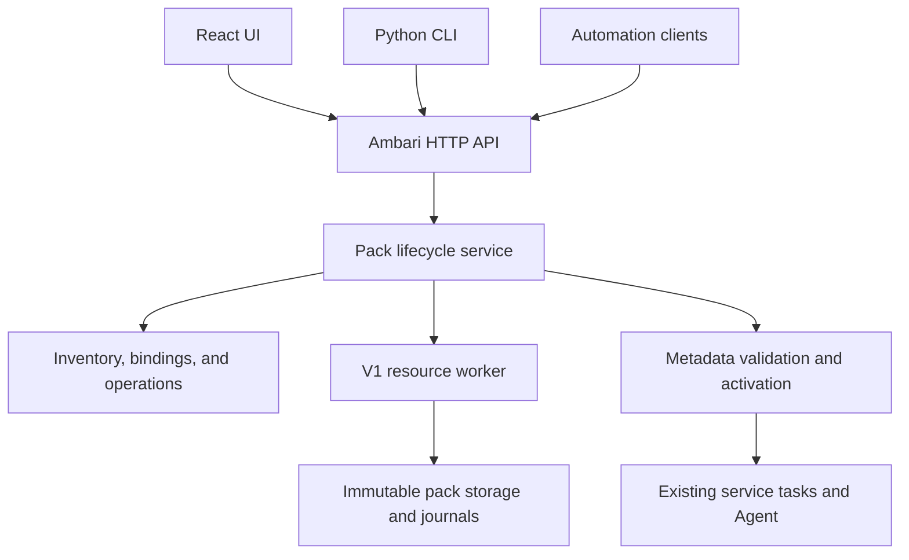

<!---
   Licensed to the Apache Software Foundation (ASF) under one or more
   contributor license agreements.  See the NOTICE file distributed with
   this work for additional information regarding copyright ownership.
   The ASF licenses this file to You under the Apache License, Version 2.0
   (the "License"); you may not use this file except in compliance with
   the License.  You may obtain a copy of the License at

       http://www.apache.org/licenses/LICENSE-2.0

   Unless required by applicable law or agreed to in writing, software
   distributed under the License is distributed on an "AS IS" BASIS,
   WITHOUT WARRANTIES OR CONDITIONS OF ANY KIND, either express or implied.
   See the License for the specific language governing permissions and
   limitations under the License.
--->

# Management Pack V1 Evolution Plan

Acceptance starts at [README.md](README.md). Use the
[runbook](acceptance-runbook.md) and [results ledger](acceptance-results.md) for
execution evidence; this design is not a runtime acceptance report.

Date: 2026-09-17

Status: The user-directed delivery scope is frozen. Source implementation,
final Java/React compilation, and focused regressions are complete; live
deployment acceptance and commits are not complete. Track actual evidence
against the [delivery baseline](delivery-baseline.md). The implemented API is
described in the [HTTP contract](http-api.md); release acceptance remains
separate from passing focused tests.

Sections 1, 3, 4, 7, and 8 define scope, responsibilities, and behavior. Section 2
provides source evidence; the API names and layouts in sections 10 and 11 are
reference layouts. Section 13 maps the design to acceptance coverage.
Maintain each rule in its owning section and reference it elsewhere rather than
introducing competing descriptions of the same policy.

## 1. Direction and Goals

Evolve V1 rather than replace it. Preserve the flexibility of management packs,
the `mpack.json` artifact model, stacks, extensions, inheritance, and the existing
service management framework. Improve their usability through one lifecycle
service shared by HTTP clients, the UI, and the CLI.

The result must support both complete Hadoop services, including HDFS, and
ordinary software deployed on bare-metal hosts. Packaging a service must not
remove capabilities that the same service has when supplied with Ambari.

The main goals are:

1. Package a single service, multiple services, or a complete platform.
2. Install, update, bind, unbind, and uninstall management packs through HTTP,
   the UI, or a CLI that uses the same HTTP API.
3. Maintain third-party packs in a separate Git repository.
4. Build one pack, selected packs, all release-selected packs, or a profile with
   Python tooling.
5. Upload multiple independent packs in one bundle and manage them separately
   after installation.
6. Deploy software without requiring Hadoop services or a Hadoop stack.
7. Add ordinary software primarily through pack definitions rather than changes
   to Ambari core.
8. Extend insufficient software management capabilities through explicit,
   versioned contracts.

Historical package quirks, old CLI argument compatibility, automatic adoption of
old installations, and replay-log migration are not delivery requirements.
This permits stricter validation and corrected behavior. It does not permit
removing valid V1 capabilities or reducing rich services to basic install/start/
stop scripts.

This design retains `mpack.json`. It supersedes the earlier suggestion to
replace V1 with a new `mpack.yaml` format.

### 1.1 Confirmed Architecture Review Decisions

| Decision | First-release boundary |
| --- | --- |
| Controlled activation | Additions and unreferenced definition updates may activate online; in-use updates use a maintenance workflow and may require a server restart |
| Preserve V1 capabilities | Keep all four artifact types and complete service resources; exclude a new workflow DSL; defer arbitrary frontend plugins and recommendation solvers |
| Simple user experience | One command or wizard performs upload, checks, installation, and eligible binding; durable plans, ownership, digests, and recovery remain internal guarantees |
| Early end-to-end validation | In phase 1, deploy Nginx in GENERIC without Hadoop dependencies and verify HDFS loading, Agent distribution, and execution |
| Binding scope | Clusters sharing a stack/version share effective definitions; independent per-cluster selection of the same service's definition release is out of scope |
| Publication unit | Validate and publish a definition-set snapshot containing exact packages, bindings, inheritance dependencies, and execution resources |
| Execution resources | Pin the definition set and resource references at task creation; scheduling, retries, and Agent recovery cannot substitute current releases |
| GENERIC semantics | Manage the foundation runtime contract separately from each service's repositories and target software version; do not simulate a unified Hadoop distribution |
| Internal artifact model | Preserve four V1 inputs and normalize them into resource contributions and change plans, not four lifecycles |
| Software extension boundary | Express ordinary operations in packs; deliver new cross-host decisions through explicit server handlers |

Arbitrary zero-downtime hot replacement of in-use service definitions is not a
first-release promise. Controlled update, uninstall, bundles, and recovery are
still required for the first complete release; they are not deferred merely to
make an installation-only demonstration easier.

### 1.2 Architecture Decision Criteria

Evaluate each design choice against current requirements and these criteria:

- Keep one authoritative owner for each business decision and persistent
  state; make responsibilities and contracts between components explicit.
- Prefer the smallest design that delivers the required end-to-end behavior.
  Introduce a framework only after concrete uses justify its maintenance cost.
- Preserve valuable V1 capabilities and reuse reliable Ambari mechanisms.
  Refactor weak implementations when needed rather than preserving their
  internal structure as a compatibility obligation.
- Define failure, concurrency, activation, and recovery boundaries before
  claiming successful operation. Validate them through structured observations
  and executable acceptance cases.
- Keep common user operations simple, keep advanced behavior explicit, and
  minimize duplicated schemas, dependency logic, and service semantics.
- Prove both simple and complex service paths before freezing abstractions.
  Assess designs by operational and maintenance results, not resemblance to
  historical implementations or the number of extension points.

### 1.3 Scope and Invariants

The project improves V1 package delivery and lifecycle management while reusing
Ambari's service definitions, configuration, tasks, and Agent execution. It
does not redesign service instance identity or introduce independent same-host
instances of one component. Single-node and distributed services remain
expressible with the existing component model. Software retains responsibility
for its own leader election and replication protocols.

The following conditions must always hold:

- Every mutation of managed definitions, bindings, or activation state passes
  through the same lifecycle application service and concurrency checks.
- An unverified candidate never becomes the effective definition set.
- Files written, a worker exit code, or an HTTP acknowledgement alone never
  establish operation success.
- Tasks do not silently switch to scripts from another package release.
- Resources needed by active references or recovery cannot be garbage-collected.
- Conflicting persistent state and observed resources require reconciliation,
  not an assumption that the intended operation succeeded.
- Once an operation is accepted, the server owns its progress and recovery
  independently of the submitting client.

### 1.4 Delivery Scope Freeze

The user approved a corrective implementation on 2026-09-22: distribute
`ambari-mpacks` (mpackstore) as one bundle, import it without executing package
hooks, expose its services for subsequent selection and deployment, and replace
long-lived global maintenance with resource/definition-scoped conflict checks.
One publication coordinator remains; unrelated service and administrative work
must continue. Publication, cancellation and hook recovery must retain a coherent
verified view and durable ownership until their completion boundary. Existing
component category changes require a supported migration, not an online refresh.
These decisions supersede earlier global-drain and store-only-install behavior.
No online marketplace or new workflow engine is introduced.

The scope was narrowed on 2026-09-17 at the user's direction to finish the
implementation without adding frameworks. The delivery boundary is the
HTTP-owned install/update/bind/unbind/uninstall and recovery flow, its CLI and
React clients, immutable execution resources, and the GENERIC bare-metal path.
Preserve existing service definitions and HDFS capabilities; do not replace
them with a simplified service format. Remaining work is defect correction,
focused regression coverage, final builds, commits, and documentation audit.

Do not add automatic garbage collection, aggregate storage quota scheduling,
an online coordinated backup service, a new non-daemon example, a new status
telemetry protocol, or generated API clients in this delivery. Retain managed
archives, snapshots, and Agent caches instead of deleting potentially referenced
resources. Per-archive limits and plan expiry remain enforced. Operators must
monitor disk capacity. Offline backup requires stopping the Server and copying
its database and complete managed store from the same stopped state; partial
restores and live filesystem-only backups are not supported.

These limits replace the automatic cleanup and backup implementation scope in
sections 8.6 and 8.7, not the safety invariants in section 1.3. Documentation
must expose incomplete deployment acceptance and verification failures rather
than claiming parity from source inspection. Run compilation only after the
frozen implementation is complete, as requested.

## 2. Analysis Baseline

The remote trunk head was checked during the source analysis:

| Branch | Commit | Commit date |
| --- | --- | --- |
| `trunk` | `116be946fb5f911236db70861631eb4ed95792cc` | 2026-09-14 |

The observations in this section are based on source inspection. No build,
automated test, or live Ambari deployment was run as part of that analysis.
They must not be interpreted as runtime acceptance evidence.

### 2.1 Current V1 and the Existing Java API

Trunk contains two different management pack paths:

| Path | Existing behavior | Main gaps |
| --- | --- | --- |
| Python V1 CLI | Archive installation, four artifact types, hooks, update, uninstall, resource links, and replay records | No unified durable inventory, transactional activation, complete usage protection, or HTTP integration |
| Java `/mpacks` | REST resources, database entries, metadata download, module extraction, and generated stack integration | Uses `definition` and `modules`; does not provide the V1 archive lifecycle |

Primary entry points are
[setupMpacks.py](../../ambari-server/src/main/python/ambari_server/setupMpacks.py),
[MpacksService.java](../../ambari-server/src/main/java/org/apache/ambari/server/api/services/MpacksService.java),
[MpackResourceProvider.java](../../ambari-server/src/main/java/org/apache/ambari/server/controller/internal/MpackResourceProvider.java),
and [MpackManager.java](../../ambari-server/src/main/java/org/apache/ambari/server/mpack/MpackManager.java).

Important findings:

- V1 upgrade installs the new version and removes older versions before the
  post-upgrade hook completes. A later hook failure does not provide a reliable
  rollback to the old installation.
- The Python uninstall path removes staged content and links without a complete
  authoritative usage model. The Java delete path instead rejects deletion when
  any cluster exists, even if the selected pack is unused.
- File deployment, database registration, and loaded metadata do not share one
  durable operation and verified completion condition.
- Validation needs tightening. For example, an incompatible
  `max_ambari_version` does not set the failure flag, and an unknown artifact
  type is reported without rejecting the installation.
- `AmbariManagementControllerImpl.updateStacks()` reinitializes metadata. This
  provides an integration point, not an atomic candidate-validation and
  activation mechanism.
- An extension link targets a stack name and version. A change can affect more
  than one cluster using that stack; a cluster-scoped UI does not make the
  underlying binding cluster-scoped.
- StackManager construction also creates extension links automatically after
  database registration. Routing extension-link HTTP endpoints through one
  service does not remove this implicit binding path.
- ActionScheduler injects current resource digests at dispatch, and Agent caches
  are addressed by resource directory. Digest verification alone does not pin
  queued tasks to the resource version selected when they were created.
- Service creation depends on RepositoryVersionEntity and uses it to locate the
  stack and service definitions. GENERIC must define this mapping; adding a
  foundation pack does not automatically decouple software versions.
- The React host assignment implementation includes a path that inserts
  `ZOOKEEPER_SERVER`. General-purpose deployment requires reviewing and fixing
  assumptions of this kind.

Additional source references:

- [AmbariManagementControllerImpl.java](../../ambari-server/src/main/java/org/apache/ambari/server/controller/AmbariManagementControllerImpl.java)
- [AmbariMetaInfo.java](../../ambari-server/src/main/java/org/apache/ambari/server/api/services/AmbariMetaInfo.java)
- [ExtensionHelper.java](../../ambari-server/src/main/java/org/apache/ambari/server/stack/ExtensionHelper.java)
- [StackManager.java](../../ambari-server/src/main/java/org/apache/ambari/server/stack/StackManager.java)
- [ActionScheduler.java](../../ambari-server/src/main/java/org/apache/ambari/server/actionmanager/ActionScheduler.java)
- [ServiceResourceProvider.java](../../ambari-server/src/main/java/org/apache/ambari/server/controller/internal/ServiceResourceProvider.java)
- [ServiceImpl.java](../../ambari-server/src/main/java/org/apache/ambari/server/state/ServiceImpl.java)
- [AssignMasters.tsx](../../ambari-web/latest/src/components/AssignMasters.tsx)

### 2.2 V1 Capabilities to Preserve

| Capability | Evolution approach |
| --- | --- |
| `mpack.json` and `artifacts` | Preserve; add an explicit schema and strict validation |
| Four artifact types | Preserve their expressive power; unify planning, ownership, and execution |
| `metainfo.xml`, configuration, and Python service scripts | Continue using the existing service framework |
| Stacks, common services, extensions, and inheritance | Preserve; make dependency resolution and bindings explicit |
| Advisors, Kerberos, alerts, metrics, and quicklinks | Include in resource management and acceptance coverage |
| Correct installation and resource mapping logic | Extract reusable logic and add structured observations and recovery |
| Hooks | Preserve useful extensibility with declared phases and recovery boundaries |
| CLI filesystem mutation and replay-driven recovery | Replace with HTTP operations and durable lifecycle records |

## 3. Product Semantics

Keep three independent concepts:

| Layer | Managed object | Example |
| --- | --- | --- |
| Pack lifecycle | Definitions, scripts, and resources on the server | Install or update the HDFS pack |
| Definition binding | Association with a target stack/version | Enable an extension for BIGTOP or GENERIC |
| Software lifecycle | Software, configuration, and data on hosts | Deploy HDFS, enable HA, or upgrade PostgreSQL |

The UI may combine installing and binding into a convenient wizard, but each
result must remain independently observable. A pack update must not silently
upgrade host software. Removing a pack must not silently delete business data.

Support both a multi-service pack with one release lifecycle and a bundle of
independently versioned packs. These are different authoring and maintenance
choices, and both are useful.

## 4. Architecture and Responsibilities



### 4.1 Server Lifecycle Service

The Java server owns authorization, authoritative inventory, dependency and
usage checks, business change plans, operation scheduling, recovery decisions,
metadata activation, and HTTP responses.
Use the existing Ambari persistence and service infrastructure. Evolve the
existing pack inventory rather than maintaining two unrelated pack catalogs.

The existing Java registration path must converge on this service. Its old
URI registration semantics are not a compatibility requirement.

All write paths that affect managed definitions, bindings, or activation must
use this application service, including existing extension-link endpoints and
internal callers. Route such endpoints through it or reject the unsupported
mutation; adding checks only to the new mpack endpoints is insufficient. For
example, the current
[ExtensionLinkResourceProvider](../../ambari-server/src/main/java/org/apache/ambari/server/controller/internal/ExtensionLinkResourceProvider.java)
can change bindings and invoke metadata reload directly.

Unify authorization, ownership checks, revision validation, mutation ordering,
and operation recording at this boundary. Multiple HTTP resources may remain,
but their backing services cannot bypass the boundary or independently publish
the same change. Reuse existing binding persistence where applicable rather
than maintaining a second authoritative binding table with bidirectional sync.

A single entry point does not require one implementation class. The application
service coordinates planning, inventory, resource execution, and metadata
publication. The parser owns existing inheritance semantics; the worker owns
exact resource operations. They collaborate through explicit inputs and
structured results while the Java server retains business decisions.

### 4.2 Internal V1 Resource Worker

Reuse the resource semantics of the Python V1 implementation.
Keep the worker limited to archive inspection, preparation of resources and
Agent archives, exact filesystem changes, verification of those changes, and
server-directed compensation within managed directories. Do not invoke the old
CLI and parse its human-readable output.

The worker receives a server-authorized plan. It does not independently resolve
business dependencies, decide whether a pack can be updated or uninstalled,
schedule recovery, or mutate the lifecycle database. Its resource receipts
describe observed changes for server reconciliation. There must not be a second
planner or lifecycle state machine in Python.

The delivered resource implementation is in Java (`MpackArchiveStore`,
`MpackResources`, and `MpackSnapshots`), within the existing Server lifecycle.
There is no separate Python resource worker or worker RPC. Its input is the
normalized resource plan in section 5, not four historical artifact workflows
that mutate active directories. Python remains the authoring/HTTP client
toolchain and the existing Agent service execution language.

The protocol must validate schema version, operation ID, input digest, plan
identity, resource manifest, and result type. Process exit codes and diagnostic
logs alone never establish business success. Missing, malformed, stale, or
foreign results leave the operation failed or explicitly unresolved.

### 4.3 HTTP-Only CLI

All remote lifecycle operations use the HTTP API. The CLI must not write server
resources, access the database, or fall back to local installation when HTTP is
unavailable. Local scaffolding, validation, and archive building remain local
development operations.

Ambari must start and expose pack management before any cluster or user pack
exists. The initial setup path is server startup followed by API/UI/CLI upload;
an offline installation path is not required.

## 5. Manifest and Artifact Evolution

Retain the four V1 artifact types:

| Artifact | Purpose |
| --- | --- |
| `stack-definitions` | Complete stacks, platform foundations, and associated resources |
| `service-definitions` | Reusable service definitions |
| `extension-definitions` | Service collections that can bind to a stack |
| `stack-addon-service-definitions` | Additional services for declared target stacks |

Extensions are the recommended default for new third-party software. Complete
platform packs and complex services must retain access to the full stack and
resource model.

Offer authoring templates for an ordinary service, a service collection, and a
complete stack. Templates choose appropriate artifacts without requiring every
author to understand all four models before creating a first package. Advanced
authors retain access to the full artifact model.

The four artifact types are external input formats. Normalize them into a
resource contribution manifest from which the lifecycle service builds a change
plan. Each contribution records its provider and package digest, source artifact,
logical resource identity, content digest, declared scope, and dependencies.
The resolved plan adds target locations, affected contexts, expected prior
references, and mutations. A filesystem path does not replace the logical
identity of a service, configuration type, or shared resource.

This model covers stacks, common services, extensions, addons, and shared
resources. Root-level advisors, hooks, and dashboards must declare their actual
scope rather than implicitly belonging to one cluster. The existing Java parser
merges inheritance contributions and preserves provenance. Do not reject valid
inheritance as a conflict or treat an undeclared provider overwrite as
inheritance. Apply the same ownership, conflict, and uninstall checks across
artifact types.

Neither the Python builder nor the worker independently resolves the effective
service model or decides bindings. The contribution manifest is a generated,
verified internal representation of source definitions, not a second service
definition for authors to maintain.

Add an explicit manifest schema version and optional fields for:

- Display information, categories, documentation, and maintainers.
- Ambari, OS, architecture, and runtime requirements.
- Pack dependencies, conditional requirements, and conflicts.
- Provided services, capabilities, and shared runtime resources.
- Binding constraints, update rules, and restart requirements.
- Hook phase, timeout, retry behavior, and compensation properties.

Do not duplicate component or configuration definitions in the manifest when
they can be derived from existing service resources. Generated indexes must be
validated against those resources rather than becoming a second source of
truth.

Track pack version, service definition version, and deployed software version
separately. Initially use a documented V1 numeric pack version convention and
consistent comparison rules across Java and Python. Do not order arbitrary
software versions lexically or infer upgrade compatibility from their names.

Ambari core owns and publishes the manifest schema and client contract. Build
tools consume a pinned release of that contract rather than manually copying a
schema into each pack repository. Local validation provides early feedback;
the server remains authoritative for compatibility and lifecycle decisions.

Draft schema fields and API shapes in phase 0, exercise them through the early
Nginx and HDFS path, then freeze the public contracts with fixtures before the
first release. Do not freeze speculative extension fields before demonstrating
their need. Define package, service, software, and publisher identity rules
explicitly without introducing a tenant model as a prerequisite.

### 5.1 Initial Contract Details

The initial parser requires the integer `schema_version: 1` and retains
`type: "full-release"`, `name`, `version`, and `artifacts`. Unknown fields,
duplicate JSON keys, trailing JSON values, unknown artifact types, and overlapping
artifact source directories are errors. Identifiers contain ASCII letters,
digits, underscores, and hyphens and start with a letter. Numeric versions have
one to five decimal components without leading zeroes; comparison pads missing
components with zeroes, while release identity and exact dependency selection
preserve the full version string. Software version observations are not restricted
to this management-definition convention.

Dependencies select a package name and either an exact `version` or inclusive
`min_version`/`max_version`, optionally pinned by a lowercase SHA-256 `digest`.
Resolution must still be unique. Preserve V1 `min_stack_versions` prerequisites
and addon `service_versions_map` target mappings. Hooks explicitly declare
`timeout_seconds` (1 through 3600) and boolean `idempotent`; a declaration alone
never authorizes replay of an unresolved external effect. These details remain
draft contracts until cross-language fixtures and end-to-end acceptance pass.

Uploaded gzip tar archives contain their manifest at the root or in exactly one
containing directory. Paths use normalized relative POSIX names. Internal links
must remain inside the archive after resolution; cycles, escaping links, duplicate
members, device files, and unsupported sparse entries are rejected. Default limits
are 256 MiB compressed, 1 GiB expanded, 100,000 entries, and a 1 MiB manifest.
Archive identity is the SHA-256 of uploaded bytes. Prepared content is isolated
until validation and resource planning complete; upload never implies activation.

## 6. Complete Service Capabilities and HDFS

HDFS is a design constraint from the first phase, not an optional demonstration
after the model is finished.

The BIGTOP 3.4 stack inherits from 3.3, which inherits from 3.2. HDFS scripts also
consume stack execution context. HA, JournalNode management, Federation, and
RBF involve frontend and server workflows in addition to service resources.
Copying only the latest `services/HDFS` directory is insufficient.

Relevant evidence:

- [BIGTOP 3.4 metainfo](../../ambari-server/src/main/resources/stacks/BIGTOP/3.4.0/metainfo.xml)
- [HDFS base service definition](../../ambari-server/src/main/resources/stacks/BIGTOP/3.2.0/services/HDFS/metainfo.xml)
- [HDFS execution parameters](../../ambari-server/src/main/resources/stacks/BIGTOP/3.2.0/services/HDFS/package/scripts/params_linux.py)
- [Stack inheritance handling](../../ambari-server/src/main/java/org/apache/ambari/server/stack/StackModule.java)
- [Classic service actions](../../ambari-web/classic/app/views/main/service/item.js)

The build and import process must distinguish bundled resources, explicit pack
dependencies, and required Ambari platform capabilities. Initially preserve
resource hierarchies and declared inheritance rather than requiring every pack
to flatten its effective definition. A built archive must not secretly depend
on a source checkout or an unrelated directory remaining on the server.

Ambari's existing stack/service resolver is authoritative for inheritance,
deletion markers, advisor behavior, and configuration merging. Do not implement
a competing StackManager in the Python builder. If a resolved export is needed,
reuse the existing resolver or provide a dedicated export interface backed by
it. The builder collects declared content and dependencies; it does not invent
an independent interpretation of service semantics.

The HDFS capability matrix must include:

| Area | Required coverage |
| --- | --- |
| Components | NameNode, DataNode, JournalNode, ZKFC, Router, clients, cardinality, and placement constraints |
| Lifecycle | Installation, configuration, start, stop, status, restart, service checks, and custom commands |
| Configuration | Versions, groups, recommendation, validation, themes, and sensitive properties |
| Operations | Existing scaling, decommissioning, reassignment, and rebalance capabilities |
| Security | Kerberos, identities, permissions, and relevant plugin integration |
| Observability | Metrics, alerts, checks, and quicklinks |
| Advanced workflows | HA, JournalNode management, Federation, RBF, prerequisites, and recovery |
| Upgrades | Existing upgrade definitions, configuration migration, ordering, and version selection |
| Dependencies | Shared code, runtime context, repositories, and conditional service dependencies |

Existing advanced workflows may remain implemented in Ambari core. The pack
declares its requirements and binds to supported implementations. Installing a
pack must not claim to supply an unavailable platform workflow.

Acceptance compares the same service version under equivalent deployment
conditions. Pack origin must not reduce capabilities. Existing defects are
tracked separately; static files or matching route names do not prove parity.

The first HDFS reference pack should use a reproducible export from pinned
source definitions. This project does not immediately remove built-in HDFS
from trunk or create two manually maintained copies of its implementation.
Verify HDFS loading, Agent resource delivery, and basic execution alongside the
first Nginx path. Full HA and Federation acceptance follows, with their resource
and capability requirements established before the contracts are frozen.

## 7. Identity, Ownership, Dependencies, and Bindings

Each installed release records its exact package identity and archive digest,
owned resources, provided services, resolved dependencies, bindings, and usage.

Use three core logical objects with explicit authoritative responsibilities:

| Object | Authoritative content | Boundary |
| --- | --- | --- |
| Package release | Name, version, digest, and owned resource manifest | Release contents are immutable; storage/validation does not imply activation or host installation |
| Binding | Target scope, desired release, verified effective release, and revision | Records what is intended and what has actually taken effect in that context |
| Operation | Caller intent, target scope, exact inputs, plan/revision, steps, outcome, and recovery information | Owns the durable history and completion result of one lifecycle mutation |

These are logical responsibilities, not a requirement to create three new
tables. Map them onto appropriate existing persistence without duplicating
authority. Plan snapshots and execution receipts belong to the relevant
operation. Uploads and preview plans may have bounded retention, but do not
need separate business workflow engines. Capabilities and usage views are
queries, not independent state machines.

Compute in-use, uninstall eligibility, and update eligibility from current
references and constraints. Avoid additional persistent booleans that can
contradict the underlying bindings and operations. Recheck those predicates
when executing a mutation, even if an earlier UI response allowed it.

Rules:

- Release contents are immutable. The same name and version with a different
  digest is a conflict; identical content can be handled idempotently.
- A pack cannot silently overwrite another pack's resources with a force flag.
- Resolve dependencies to exact versions and persist the resolution.
- Distinguish definition dependencies from runtime service dependencies.
- Apply conditional dependencies to the selected capability, such as the
  ZooKeeper requirement for an HDFS HA configuration.
- Reject missing dependencies, cycles, unsupported targets, and ambiguous
  service providers.
- A shared stack/version defines the actual binding scope. Plans must list all
  affected clusters and services, including inherited effects.
- The first release does not support independent definition-release selection
  for the same service in clusters sharing one stack context.

The ownership model must support precise unlink and uninstall behavior and
prevent removal of resources referenced by running or recoverable operations.

### 7.1 Built-In Definitions and Replacement

Distribution-provided definitions, including built-in HDFS, have an identifiable
provider and resource ownership. They are not unowned files that a newly
installed pack may overwrite. Inventory of current built-in resources is
required even though automatic migration of historical mpack installations is
not a goal.

A normal install rejects conflicting service or resource definitions and
reports both providers and the affected target. Intentional replacement is an
explicit operation with usage checks, a defined scope, retained prior content,
and recovery conditions. Until a replacement path is implemented and verified,
the API rejects it; a force flag never substitutes for the operation. HDFS
reference validation can use an isolated target rather than silently replacing
the distribution's definition.

### 7.2 Bounded Dependency Resolution

For the first release, resolve explicit requirements from uploaded archives,
already installed providers, and a locked release selection. Enforce version
constraints, missing-provider checks, conflicts, and cycle detection. Do not
automatically search multiple catalogs for an optimal combination or choose
unrequested latest releases. Ambiguous resolutions require an explicit choice.
Reuse existing service dependency semantics for runtime requirements instead
of introducing a parallel generic service-dependency framework.

Validation must follow the direction of the proposed change:

| Change | Required dependency check |
| --- | --- |
| Install or bind | Validate required providers and exact resolved versions in the target context |
| Update or replace | Validate affected consumers and bindings, including those outside the uploaded bundle |
| Unbind or uninstall | Validate reverse references from packages, bindings, services, and operations |
| Bundle mutation | Validate the combined change set and affected consumers outside that set |

For example, replacing a shared provider must not break an already enabled
consumer that still requires its old release. Retaining an old release can
satisfy that reference only when the effective resource layout supports it.
Merely storing a new inactive release does not force existing consumers to
migrate. Evaluate impact against the actual activation or removal plan, and
recheck the graph at execution time. This is bounded dependency-graph
validation, not a recommendation or optimal-version solver.

### 7.3 Binding Context and Definition-Set Snapshots

The first-release binding context is a stack name and version. API targets must
identify that context explicitly. A cluster ID may help select a target or
display impact, but cannot narrow the actual mutation scope. Two clusters using
GENERIC/1.0 share that context's extension definitions and cannot independently
activate different definitions of the same service. Installing multiple package
releases does not change this limit; retaining old task resources does not
provide per-cluster definition isolation.

Independent per-cluster definitions would require a separate evolution of
context identity, loader queries, service objects, and task creation contracts.
Adding cluster_id to bindings is insufficient, and duplicating stack versions
must not become an implicit substitute.

Each publication uses an immutable definition-set snapshot. It records a unique
identity, content digest, resolution-contract version, exact package providers,
binding revisions, inheritance dependency closure, effective resource provenance,
and Agent archive paths and digests. Changes to shared resources include every
affected context. Snapshots may reference unchanged content without copying the
entire resource tree.

A snapshot is versioned operation input and publication evidence, not a fourth
business workflow. Desired and verified-effective binding records reference the
corresponding snapshots, as do tasks. A persisted effective record describes the
last verified result. After restart, the server must load and verify it again
before claiming that the current runtime is ready.

## 8. Lifecycle, Activation, and Recovery

### 8.1 Common Operation Flow

```text
Receive archive
  -> validate and resolve dependencies
  -> create a change plan
  -> recheck current state before execution
  -> stage resources
  -> prepare Agent archives and digests
  -> apply changes
  -> validate and activate metadata
  -> verify the authoritative result
  -> complete or enter an explicit recovery state
```

Plans include affected resources, bindings, services, clusters, dependencies,
required maintenance conditions, restart requirements, and compensation limits.
Bind each plan to a state revision and exact package digests. Reject stale plans
rather than executing against a changed environment.

Initially serialize operations that mutate shared pack resources or metadata.
Uploads and read-only validation can run concurrently. Deployment and other
service operations must respect the same definition-mutation boundaries.

Each operation has an explicit input, precondition, and completion contract:

| Operation | Required inputs and preconditions | Verified completion |
| --- | --- | --- |
| Install, optionally with binding | Validated archive digest, resolved providers, authorized target, and conflict-free plan | Release resources are registered and available; requested bindings are verified effective |
| Update or replace | Exact old/new releases, target revisions, reverse-dependency checks, and required maintenance conditions | Target bindings and runtime resources match the accepted release; recovery references remain valid |
| Unbind or uninstall | Exact target identity/revision and no blocking references | Requested bindings or owned resources are removed and metadata is verified; host software and data are unaffected |

Client defaults may combine install and binding, but the accepted intent fixes
the completion scope. A staged update waiting for restart is not completed
activation. Uninstall does not imply deleting retained recovery archives before
their retention and reference checks permit cleanup.

### 8.2 State and Completion

Use the authoritative objects in section 7 to distinguish installed-but-unbound
content, a staged update with the old release still active, and an operation
that failed or needs recovery. Report desired and verified effective releases
separately rather than collapsing these observations into one installed flag.

An HTTP acknowledgement means accepted, not completed. Successful activation
requires confirming the intended resource manifest and loaded metadata for the
same operation and generation. UI and CLI consume these structured records.

Before returning an accepted operation, durably record its complete execution
intent, exact input identities, target scope, preconditions, and idempotency
identity. Only accepted durable work may execute. The server must be able to
discover and resume that work after restart, including when queue delivery or
the HTTP response was lost. Execution must not depend on a later browser or CLI
request to trigger each business step.

After acceptance, the server advances the operation or records an explicit
waiting, failed, or recovery-required condition. User intervention may be
required by the accepted maintenance policy; loss of the submitting connection
is not itself such a requirement. Client timeout is neither cancellation nor
proof of failure.

Startup reconciliation compares durable operation steps, exact filesystem
resources, and loaded metadata. It must not blindly rerun all hooks or infer
state from old console output.

### 8.3 Updates and Uninstall

Retain old resources until the new release has been verified. Protect active
definitions from incompatible changes, concurrent service operations, and
uncontrolled updates to shared stack contexts.

The first-release activation policy is:

| Change | Default handling |
| --- | --- |
| Add a non-conflicting service definition | Online activation after validation |
| Update an unreferenced definition | Online activation after validation |
| Update an in-use definition | Controlled maintenance workflow across affected contexts |
| Change an in-use component category, cardinality, version advertisement or component set | Reject until an explicit supported migration exists; a restart alone is insufficient |
| Upgrade host software | Separate service upgrade operation |

For in-use changes, identify all affected clusters, gate conflicting new work,
and account for queued and running tasks before switching definitions. Refresh
the affected runtime objects or require restart; replacing metadata files alone
is insufficient. A maintenance workflow does not imply that every update must
stop the managed software, but its actual interruption requirements must be
reported before execution. Arbitrary zero-downtime hot updates are out of scope
for the first release.

Reservations identify exact stack/version/service consumers, including inherited
resources and shared hooks, and relevant configuration types. Other services in
the same stack and unrelated administrative mutations remain available. Drain
only affected tasks; preserve exact original-task control so HOLDING tasks can be
resolved. Candidate preparation and hook subprocesses do not hold the exclusive
publication lock. Scoped reservations are reconstructed from the retained plan
after restart. The final publication boundary must never expose mixed generations.

Uninstall checks exact dependent packs, bindings, services, and operations.
Return structured blockers rather than rejecting every deletion because any
cluster exists. Removing host software or business data remains a separate
explicit operation.

### 8.4 Metadata and Hooks

Store import only validates, stores and registers available definitions. It does
not run install hooks. ENABLE runs install hooks for newly activated providers;
removing inactive imports does not run uninstall hooks. Online execution requires
`scope: "DEFINITIONS"`; omitted/SERVER scope remains importable but is rejected
for online execution. The scope is an author-declared effect boundary, not a
subprocess sandbox. No global maintenance is silently inferred from an unknown hook.

Cancellation records its intent and administrator before restoring the retained
view. Notification/commit failures keep it resumable as cancellation. Valid failed
receipts with known absent effects are persisted during reconciliation so explicit
retry or cancellation can proceed without fabricating successful effects.

Use the metadata reload integration point for candidate validation and controlled
publication. Separate StackManager resource reading and inheritance resolution,
validation without persistent side effects, and committed registration and
publication. Candidate parsing consumes explicit resource and binding snapshots;
it does not fill missing inputs from changing active directories or write
business records or active resources. The existing Java parser remains
authoritative for inheritance semantics.

Candidate resolution also isolates service-check registration and does not run
remote repository discovery. Both are side effects of the current StackContext.
Declared repository inputs belong to the snapshot; optional discovery cannot
silently change the candidate. Publish the candidate's service-check metadata
only inside the activation boundary.

Convert autolink into a visible, authorized binding intent during planning.
Constructors and reload must no longer create links implicitly. Candidate
inspection, startup loading, and ordinary reads cannot mutate bindings.
Declaring autolink cannot silently add unselected compatible targets to an
operation.

Coordinate loaded metadata, attributes retained by existing service/component
objects, advisors, and Agent resource references. Keep the previous valid state
available when candidate activation fails. Restart-required changes are not
reported as active until startup verification succeeds.

Resource publication is part of activation, not a later packaging detail:

```text
Service and shared resources
  -> Agent archives and trusted digests
  -> matching metadata and task references
  -> verified activation
```

Reuse the existing resource distribution path, including
[resourceFilesKeeper.py](../../ambari-server/src/main/python/ambari_server/resourceFilesKeeper.py),
[ResourceManager](../../ambari-server/src/main/java/org/apache/ambari/server/resources/ResourceManager.java),
and [FileCache](../../ambari-agent/src/main/python/ambari_agent/FileCache.py).
Their `archive.zip` and digest contract must remain consistent with published
definitions. Do not build a separate Agent distribution service.

The first release pins resources at task creation. When accepting and persisting
a task, record its definition-set identity and immutable paths and trusted
digests for service scripts, shared hooks, and other execution resources.
Scheduling, retries, and recovery preserve these references. Change the current
ActionScheduler behavior that injects current digests at dispatch; it must not
overwrite pinned references. Changed inputs require an explicitly related new
operation rather than mutation of the old task.

Server distribution addresses and Agent caches both use immutable resource
version identities and allow referenced versions to coexist. Retaining an old
digest in the database while replacing the same archive.zip or cache directory
does not satisfy this contract. Reuse transport and digest verification while
extending addressing and retention. Pinned tasks still require coordination for
configuration and component-model changes under section 8.3; versioned scripts
do not make arbitrary old tasks safe to execute alongside new definitions.

Entrypoints without ordinary task IDs, including status checks, pin their
resource set and a verifiable execution identity when generating a request.
They cannot resolve the latest release at Agent execution time. Agents returning
from an outage verify the original references. With cache auto-update disabled,
a missing or mismatched version fails explicitly instead of using another cached
release. References cover queued, running, retryable, and background executions;
cleanup follows release of those references and retention policy. Definition
activation and successful host execution remain separate observations.

Inspection and planning never execute package scripts. Hooks run only in an
authorized execution phase. Arbitrary external side effects are not guaranteed
to be reversible. Non-idempotent or unresolved hook effects require explicit
recovery handling rather than automatic replay.

The initial hook receipt contains `schema_version`, `operation_id`, `plan_digest`,
`archive_digest`, `phase`, `attempt`, `state`, `effect_state`, and `observations`.
The runner supplies the exact identities and receipt path through
`AMBARI_MPACK_*` environment variables. Diagnostics are not receipts. A completed
hook requires `state: APPLIED`, a known effect state, and structured observations
from the package's verification logic. Missing, malformed, or foreign receipts
remain unresolved even if the process exits successfully.

Explicit failed-item retry is limited to a hook declared idempotent whose
validated receipt says `FAILED` and `NOT_APPLIED`. Retain that attempt in history,
increment the attempt identity, and use a new receipt path. Completed hooks are
not rerun. `recover` reconciles an existing receipt against the original operation
and attempt; it cannot turn an unobserved external effect into success. Safe
cancellation requires all observed hook effects to be `NOT_APPLIED` and reports
the verified definition set actually retained, including any prior publication.

### 8.5 Bundle Operations

A bundle operation has a parent identity and per-pack results. Validate the
selected dependency closure before applying changes. Stage content before
activation where practical, but do not promise atomic rollback of arbitrary
hook side effects across the entire bundle.

Partial failure must identify completed, failed, blocked, and recoverable
children. Retries preserve operation lineage and do not repeat completed
non-idempotent work.

Expose a retry-failed-items action when the current dependency and resource
state allows it. Keep successful items by default rather than uninstalling them
because another item failed. Revalidate remaining work before retrying it.

The initial implementation stages the selected bundle closure and publishes its
combined definition snapshot. Each requested package has a stable member identity
derived from the parent operation, exact release, and archive digest. Member
results are views of the accepted plan, committed publication, and per-package
hook receipts, not independently writable status flags. A member without a
verified publication cannot report success merely because its hooks returned.
After publication, a later hook failure preserves successful members and exposes
failed, unresolved, and blocked members separately.

### 8.6 Startup Recovery and Commit Boundaries

HTTP-only administration requires a bad candidate not to disable the server
needed to repair it. Keep unverified content out of the committed startup
definition set. Retain the last verified set and its resources, reconcile
interrupted operations before loading managed definitions, and isolate failed
candidates without discarding the valid environment.

A database transaction, a filesystem rename, and runtime publication are not a
single atomic transaction. Specify durable intent, step receipts, commit
ordering, and verification at every boundary. The first-release publication
sequence is:

1. Persist the accepted operation and inputs. Prepare immutable resources,
   archives, and a definition-set snapshot in isolation, then validate the
   candidate without persistent side effects. The effective set remains unchanged.
2. Gate conflicting mutations and new task creation across affected contexts
   and shared resources. Recheck revisions, references, and maintenance conditions
   and coordinate existing tasks and background execution. Wait or fail if the
   prerequisites cannot be met.
3. In a database transaction, record the pending snapshot, expected prior
   snapshot, operation ID, and publication generation, and register required
   metadata. Desired records may advance; verified-effective records still
   reference the prior set. Queries cannot present pending content as effective.
   If restart is required, retain the gate and waiting state so startup recovery
   can continue this protocol.
4. Within the gate, publish runtime definitions, matching advisors, and resource
   references, and refresh existing service/component objects. Verify the
   operation, generation, snapshot, and digests. Definition reads and execution
   entrypoints cannot observe mixed generations. Require restart or reject a
   transition that cannot refresh safely.
5. After verification, commit the effective snapshot and publication result
   with revision checks, then release the gate. Operation completion also requires
   the remaining accepted steps. A later hook failure cannot erase the fact that
   publication has already taken effect.

The gate is lifecycle concurrency control, not another persistent state machine.
Reconstruct it from unfinished operations before reopening affected mutation and
execution entrypoints after restart. A crash after step 3 does not establish
activation. If the receipt is lost after step 4, reconcile exact resources and
publication records, then reload the same candidate or a verified recoverable
prior set without replaying hooks of unknown outcome. Record operation identity,
generation, and actual outcome for recovery and compensation too; do not rewrite
history. Pack-management queries and supported recovery APIs must remain
available while affected service execution is gated.

Failure handling requirements:

| Failure point | Required behavior |
| --- | --- |
| Upload or validation | Leave the effective environment unchanged; permit a corrected upload |
| Resource preparation | Keep current definitions effective and identify removable staging content |
| Resources changed before the result was recorded | Reconcile exact resources with durable intent and receipts; do not blindly apply the change again |
| Activation | Preserve or restore the prior verified definitions when possible and report the actual recovery outcome |
| Completion response lost | Resolve the original operation through its idempotency identity; do not install again |
| External hook outcome unknown | Preserve an unresolved recovery condition; do not rerun the hook to guess its outcome |

If no consistent verified state can be restored, report that condition and
follow a documented recovery procedure instead of reporting success. Do not
add a hidden local-install fallback to the CLI. The first delivery supports
only operator-coordinated offline backup of the database, complete managed
store, and activation records from one stopped Server state. Restore them
together; startup must verify the persisted snapshot and resource identities.
An automated or online coordinated backup/restore service is out of scope.

Recovery scopes must remain distinct:

| Scope | Recovery contract |
| --- | --- |
| Pack resources and bindings | Restore only the changes owned by this operation, using its manifest and revision checks |
| Service configuration | Use exact configuration versions and preconditions; do not overwrite changes made after this operation |
| Host software or business data | Use the explicit service operation and its supported recovery contract |
| Unresolved external side effects | Preserve the observed uncertainty and expose the required recovery action |

Switching a package directory back is not proof of complete rollback. A
configuration written by another operation after the update must not be
replaced by an old snapshot. Detect that revision conflict, retain both the
recorded intent and current state, and stop blind compensation. If the old
definition cannot safely use the current configuration, keep recovery pending
rather than reporting that the environment was restored.

### 8.7 Storage, Permissions, and Retention

Store dynamic pack content and staging data in explicitly managed directories
writable by the Ambari Server service account. Do not require a general root
execution privilege or recursively change ownership of distribution-managed
resource trees during an online operation. Define the permitted paths and
execution identity of server hooks separately from Agent service commands.

Enforce per-archive compressed/expanded/member limits and reject expired plans
at acceptance. The first delivery keeps uploads, plans, release resources,
snapshots, and Agent caches; it has no automatic expiry deletion, aggregate
store quota, or garbage collector. Uninstall retires definitions, not their
recovery bytes or host data. Operators must monitor available disk space and
must not manually delete managed resources while the Server is active.

Any later garbage collector must check active bindings, task references,
unfinished operations, and recovery retention before removal. Deleting a
cached archive must never remove the only recovery copy of an active or
recently replaced definition. This future cleanup contract is not a claim that
automatic cleanup is delivered.

## 9. General-Purpose Deployment and Extensibility

Publish a `GENERIC` foundation stack as a normal V1 pack. It must not inherit
Hadoop requirements. Supply the runtime, repository, advisor, and installation
metadata necessary for a real deployment, not merely an empty stack directory.

Support compatible extensions in existing BIGTOP environments and independent
third-party deployment in GENERIC environments. Service selection, host
assignment, repositories, configuration, and Agent context must follow declared
requirements. Rich Hadoop packs retain their richer execution environment.

The GENERIC stack version identifies a foundation runtime contract, including
common configuration, default advisors, and Agent context requirements. It is
not a unified distribution of Nginx, PostgreSQL, and other software. Updating
the foundation pack does not implicitly change deployed software versions, and
each software version does not require a new GENERIC stack version.

| Layer | Authoritative meaning |
| --- | --- |
| GENERIC stack version | Foundation runtime contract and compatibility boundary |
| Mpack release and definition set | Management definitions, scripts, and their exact composition |
| Service software delivery selection | Target software version, OS/architecture, repositories, and package requirements |
| Host software observation | Actual installed version established by typed service or package-manager results |

Service creation currently depends on RepositoryVersionEntity and its stack
identity to locate definitions. Retain that integration point initially and
define the mapping from service delivery selections to repository records.
Do not automatically interpret a repository version string as the GENERIC
version or a common version for all software. Prefer existing service-level
associations. If current validation, uniqueness constraints, or upgrade paths
cannot support independent selections, record the gap in phase 1 and implement
the smallest necessary adaptation before freezing the contract. Do not bypass
the problem by inventing a unified distribution version.

The current repository validator requires a repository version to start with its
stack version. Add a stack-level `repositoryVersionMode` with `DISTRIBUTION` as
the inherited legacy default and `INDEPENDENT` for foundations such as GENERIC.
Only the distribution-prefix check is waived for `INDEPENDENT`; OS support,
repository identity, permissions, and explicit service repository selection
remain enforced. Repository records identify the selected delivery source and
version; they do not prove the version installed on a host. Services without the
existing stack-version advertisement contract do not opt into rolling stack
upgrade merely because independent repository versions are accepted.

Reuse AmbariMetaInfo's default version-definition generation from stack and
repoinfo; do not add a second foundation registration mechanism. A default VDF
may have an empty upgrade manifest when no service advertises a distribution
version. Its stack-service list still exposes ordinary software. The foundation
version in this bootstrap repository definition is not a software target or an
observed installed software version.

Each service delivery selection identifies its repositories, packages, and
target version using existing metadata and OS package management. Do not
duplicate authoritative repository configuration in the manifest. Different
services in one GENERIC context may select their own supported software versions,
while definitions retain the shared scope in section 7.3. Software versions
must follow paths explicitly supported by the selected definition. Report an
unimplemented independent upgrade contract as unsupported, not as a stack upgrade.

Ordinary services must not require stack-select or Hadoop, or depend on a BIGTOP
fallback for missing parameters. Services without stack-select report versions
through explicit structured observations. Missing results remain unknown or
failed; GENERIC, mpack, and repository versions cannot substitute for an actual
software version.

The existing Agent hook location is global and its default hooks perform Hadoop
and Java setup. Add an optional `hooksFolder` to stack `metainfo.xml`: omission
inherits the parent setting, then falls back to the existing server setting;
an empty value disables stack hooks; a nonempty value names a normalized path
relative to the resource root. GENERIC explicitly disables these hooks. Publish
and pin the selected directory with the definition snapshot instead of selecting
hooks by a hardcoded stack name. This extends an existing execution input, not
the workflow language.

### 9.1 Reuse Existing Service Semantics

Before adding a capability field or format, check whether `metainfo.xml`,
custom commands, advisors, or existing upgrade descriptors already express it.
Expose and validate those definitions consistently instead of asking authors
to maintain a second capability manifest with conflicting semantics. Add new
fields only for demonstrated gaps and assign each fact one authoritative owner.

Preserve existing service capabilities and introduce new common contracts only
where concrete services demonstrate a shared need. The following are extension
boundaries, not a requirement to build every generic framework in the first
release:

| Extension | Required contract | First-release treatment |
| --- | --- | --- |
| Custom action | Inputs, permission, prerequisites, timeout, idempotency, execution, and structured result | Reuse custom commands; add parameter descriptions and simple forms where needed |
| Health check | Liveness, readiness, or business check with a defined result schema | Reuse service checks and alerts; define concrete example-service observations |
| Operational workflow | Ordered steps, task lineage, checkpoints, retries, and compensation boundaries | Reuse existing service scripts, supported handlers, and task mechanisms; do not introduce a new workflow DSL |
| Software upgrade | Supported paths, migration, stop conditions, verification, and rollback limitations | Preserve existing upgrade descriptors and execution mechanisms |
| Data operation | Separate backup, restore, and cleanup semantics and permissions | Keep explicit service operations; defer a generic data-operation framework |
| UI capability | Forms, action entry points, result rendering, and supported advanced workflow bindings | Support simple declared forms and existing handlers; defer arbitrary frontend plugins |

Reuse existing Request/Stage/Task and Agent mechanisms. Do not create a second
host task execution platform. Generic actions should render from declared
schemas; complex existing workflows initially bind to supported core handlers.
Manifest declarations do not authorize arbitrary frontend code execution.

Adding ordinary software primarily through packs applies to capabilities that
existing execution mechanisms can express, not arbitrary complex operations.
Implementation responsibilities are:

| Capability | Implementation owner |
| --- | --- |
| Installation, configuration, start/stop, and single-host custom actions | Pack metadata and service scripts using existing Agent execution |
| Ordered operations expressible through existing upgrade mechanisms | Existing upgrade descriptors and execution, with verified applicability |
| New cross-host decisions, coordination, and recovery rules | Explicit server handlers using existing task infrastructure; deliver required core changes separately |

Request/Stage/Task provides execution infrastructure, not service-specific
business semantics. Existing HDFS handlers do not prove support for a new
software product's primary/replica switchover. New handlers must define inputs,
permissions, prerequisites, task lineage, and recovery observations. Packs may
bind only to supported implementations; unknown implementations are rejected.

Use explicit backup of a single PostgreSQL instance and restore in an isolated
acceptance environment as the first stateful reference, without overwriting the
source instance's data or extending service instance identity within a cluster.
Verify backup identity, source-instance association, recovery target, service
observations, and failure retries to test the boundary between
pack scripts and existing tasks. This does not promise cross-host automatic
failover or a general backup framework.

Do not introduce a new general-purpose workflow DSL, interpreter, or workflow
engine for mpack services. This is an architecture boundary for the project,
including later delivery phases, not a feature deferred from the first release.
Complex services already demonstrate that scripts, existing upgrade
descriptors, supported handlers, and Request/Stage/Task can express rich
behavior. Reuse those mechanisms and extract focused helper functions where
useful. Pack authors must not need to learn a new orchestration language, and
existing service or upgrade formats do not need to be rewritten.

Catalog recommendation algorithms, cross-catalog optimal version selection,
and a general frontend plugin runtime are later work. A shared abstraction
should be justified by at least two concrete service uses before becoming a new
framework. This limits framework scope without dropping any existing advanced
HDFS workflow from parity acceptance.

Multiple independent instances of the same named service require a separate
identity, configuration, and dependency design. They are not delivered merely
by adding a manifest field in this project.

### 9.2 Software Without a Resident Process

Packs may provide a resident service, client, command-line tool, or library.
Use existing component categories, including client-only behavior where
appropriate, before introducing new types. Installation and version checks
must not require a fictitious running process or daemon health state.

Expose only supported operations in the UI and enforce the same restrictions
on the server. Do not offer start/stop for a component without those semantics,
or a generic shrink operation when the service has no safe implementation.
For multiple deployment modes, let existing metadata and advisors express
placement and validation; a mode change requiring migration is not an ordinary
configuration edit.

Declare software delivery requirements and use existing Agent and system
package-manager mechanisms. Do not implement a competing RPM/APT dependency
solver. Definition removal, host software removal, and data cleanup remain
separate operations under section 3, including for libraries and shared tools.

## 10. HTTP API and Client Experience

### 10.1 Proposed API Resources

All resources are under `/api/v1`. Final methods, fields, permissions, error
codes, and concurrency behavior are documented in the
[HTTP contract](http-api.md). A separate OpenAPI/code-generation project is
not part of the frozen delivery scope.

| Resource | Responsibility |
| --- | --- |
| `mpack_uploads` | Uploaded archives, digests, and inspection information |
| `mpack_plans` | Validated install, update, binding, and uninstall plans |
| `mpack_operations` | Execution, progress, results, and supported recovery actions |
| `mpacks` | Unified installed package and release inventory |
| `mpack_bindings` | Explicit target environment associations |
| `mpacks/{id}/usages` | Dependencies, bindings, and uninstall blockers |
| `mpack_capabilities` | Supported schema versions, artifacts, operations, and platform capabilities |

Long operations return HTTP 202 and an operation ID. Support idempotency keys
and stable machine-readable error codes. The API owns validation and
authorization even when the client already performed local checks.

Define the caller/operation scope of an idempotency key. The same key with the
same normalized request resolves to the original operation; the same key with
different inputs or targets is rejected with a structured conflict. Persist the
association before dispatching mutations and recheck authorization when serving
the result. An identical archive digest does not by itself identify an
identical operation: binding it to another target is a different intent.

Clients discover supported capabilities before submitting incompatible work
and present actionable errors. This capability response is also an
authoritative contract; do not infer support from the server version string or
from whether a UI control happens to exist.

Resource separation supports implementation and automation, not a requirement
that ordinary users manually create an upload, plan, and binding. The default
client flow combines these stages. Preserve advanced dry-run and explicit-plan
access for users who need it. If execution invalidates a preview, explain the
changed impact and request a new decision only where it affects the user's
choice; never silently apply an expanded target scope.

### 10.2 CLI

Provide an installable CLI, provisionally named `ambari-mpack`, that does not
require checking out the third-party repository for server administration. Its
HTTP client and local authoring tools are reusable Python modules released
against the core contract. A repository `tools/mpack.py` entry point may be a
thin convenience wrapper, not an independent implementation.

Illustrative commands (local build commands run in the pack repository):

```bash
# Local authoring and building
ambari-mpack scaffold nginx
ambari-mpack validate ./mpacks/nginx
ambari-mpack build --all
ambari-mpack build --packs nginx,postgresql --bundle infrastructure

# Remote management through HTTP only
ambari-mpack install dist/infrastructure.bundle.tar.gz
ambari-mpack install dist/nginx-1.0.0.0.tar.gz --dry-run
ambari-mpack list
ambari-mpack show nginx
ambari-mpack update nginx --file dist/nginx-1.1.0.0.tar.gz
ambari-mpack uninstall nginx
ambari-mpack operations show <operation-id>
```

The CLI uploads content, requests a server-generated preview when needed,
submits the confirmed intent, and queries the resulting operation. Business
planning, execution, and recovery belong to the server under section 8.2; the
CLI is not a business scheduler. Wait for completion by default; support
`--no-wait`, `--json`, connection profiles, and recovery queries after
interrupted connections. Resolve ambiguous package/version selection before a
destructive operation.

Stopping the CLI wait, closing a UI page, or reaching a client timeout does not
cancel a server operation. Return or retain the operation ID for reconciliation.
Offer explicit cancellation only at server-declared safe steps and report its
outcome. A retry after a lost response uses the same idempotency identity rather
than creating a fresh installation blindly.

Keep credentials outside the source repository, archive contents, and logs.
Expose the client implementation as a reusable Python module rather than
duplicating HTTP logic across publishing scripts.

### 10.3 React UI

Provide a global extension-pack entry point, including before cluster creation:

- Searchable inventory with categories, versions, compatibility, and usage.
- Whole-mpackstore and single-pack import, followed by service selection.
- Dependency and impact preview before mutation.
- Install, update, bind, unbind, and uninstall flows.
- Persistent operation progress, structured errors, and supported recovery.
- Recovery of the same operation after refresh or a new browser session.
- Navigation to the existing deployment wizard after installation and binding.

The default flow is whole-store import, service selection, compatible destination,
automatic checks, necessary impact review, definition enablement, and deployment
through the existing new-cluster or Add Service wizard. Import does not run hooks
or deploy software. Unselected services remain discoverable. A multi-service pack
retains one package identity while users deploy only their selected services.
Foundation packages are dependencies, not fake runnable services. Preselect a single eligible
target; require a choice for multiple targets or conflicts. Never silently bind
to every compatible environment. A target stack shared by multiple clusters
must show the complete affected scope before changing in-use definitions.

Keep advanced plan and binding details available without making them mandatory
steps for every user. Bundle results show each item and offer eligible failed-
item retries. Error messages explain the blocker and next action rather than
only exposing internal state names or exception text.

An explicit rejected submission clears the obsolete checkpoint and permits a new
preview. Uncertain acceptance retains the original plan/idempotency identity and
offers reconciliation outside any blocking preview modal. Deployment handoffs
retain the exact operation, catalog service identities and destination; refresh
must not adopt a different cluster or silently select every service in the package.

Initially restrict package mutations to Ambari administrators through
server-enforced permissions. Validate archive paths, links, sizes, and digests.
Any later remote-download feature needs an explicit source policy.

Before implementing related React behavior, inspect both the applicable
Classic code and the Ember baseline. Record intentional differences and
regression coverage in the current React evidence. Relevant temporary baselines
include installation, stack administration, service configuration, NameNode/
JournalNode HA, and Federation. This design is not generated migration evidence.

## 11. Third-Party Repository and Build Tooling

Create an independent local repository at:

```text
/Users/jialiang/PRJS/ambari-mpacks
```

Proposed layout:

```text
ambari-mpacks/
  README.md
  LICENSE
  NOTICE
  tooling.lock
  tools/
    mpack.py                 # optional wrapper around the released tooling
  profiles/
  shared/
  mpacks/
    generic-base/
    nginx/
    postgresql/
  reference/
    hdfs/
  tests/
  dist/
```

Each software pack owns its manifest, service definitions, support matrix, and
usage documentation. Shared runtime files are bundled during building or
provided by an explicit dependency, not read from the development checkout.

`tooling.lock` represents the pinned tooling and contract dependency; its exact
format is an implementation choice. Consume the schema published by Ambari
core rather than maintaining a second manually edited `schemas/` tree here.
The repository does not become the only distribution channel for the user CLI.

Keep independent Git history. Once a remote is selected, the repository can be
referenced as a submodule under `contrib/third-party-mpacks`. Ambari core builds
must not require checking out every third-party pack. Creating or pushing a
remote is outside this document-only step.

The Python tools provide scaffolding, static validation, bounded dependency
selection, version locking, deterministic archives, checksums, provenance,
profiles, bundles, catalog generation, and HTTP publishing. Build-time checks
do not duplicate Ambari's runtime inheritance and activation semantics.
`--all` means every pack in the selected release catalog, not every historical
version.

Example bundle:

```text
infrastructure.bundle.tar.gz
  bundle.json
  mpacks/
    generic-base-1.0.0.0.tar.gz
    nginx-1.0.0.0.tar.gz
    postgresql-1.0.0.0.tar.gz
```

`bundle.json` is versioned and identifies exact member paths, names, versions,
and digests. Import validates the index against each archive. The bundle is a
transport container, not a synthetic pack that prevents independent updates.

Publish management definitions and scripts by default. Fully offline software
binaries can be supported by a separately defined payload capability, with
explicit provenance and size semantics.

## 12. Delivery Plan

| Phase | Deliverables | Completion condition |
| --- | --- | --- |
| 0: Scope and draft contracts | V1 inventory and capability matrix, draft manifest/API, binding and snapshot model, publication/recovery sequence, and GENERIC version contract | Shared-context boundaries, ownership, commit ordering, repository mapping, and HDFS resource requirements are explicit |
| 1: Early end-to-end path | Minimal lifecycle, normalized resource plans, HTTP client, GENERIC foundation, and Nginx/HDFS reference packs | Import over HTTP before a cluster exists and deploy Nginx on GENERIC without Hadoop dependencies; verify basic HDFS execution, snapshot loading, and immutable Agent resource references |
| 2: Complete lifecycle | Inventory, controlled update, uninstall, replacement boundaries, and crash reconciliation | Required lifecycle operations form a recoverable path with verified ownership and task/resource consistency |
| 3: Repository | Python tooling, bundles, completed GENERIC packaging, and example packs | Selected or all release packs can be built, uploaded, and independently managed; verify the PostgreSQL backup/restore reference |
| 4: Deployment and UI | General-purpose deployment adaptation and React management | API, CLI, and UI share behavior; non-Hadoop environments can deploy software |
| 5: Complex service acceptance | HDFS reference pack and advanced capability integration | Pack origin does not remove existing supported service behavior |
| 6: Later ecosystem work | Catalog subscriptions, more software, and demonstrated common extensions | Ordinary additions primarily change the pack repository; new frameworks require concrete shared use cases |

HDFS analysis starts in phase 0 and basic execution is exercised in phase 1.
GENERIC and Nginx deployment without Hadoop are also verified in phase 1; an
extension on BIGTOP is not a substitute. The phase 3 PostgreSQL stateful
operation and independent service software version selections validate the
extension contracts. Freeze stable public contracts with fixtures after the
relevant evidence, before first release. Phase 5 is full complex-service
acceptance, not the first test of HDFS loading or resource delivery. Passing
phase 1 is an intermediate milestone, not permission to omit updates, uninstall,
bundles, UI, or recovery
from the first complete release, which requires phases 0 through 5.

Organize coherent JIRA deliverables and reviewable topic commits for the engine,
lifecycle, API/CLI, repository tooling, UI, and complex service integration.
Keep focused tests with the behavior they verify. Database changes must cover
supported database backends and Ambari upgrade paths.

## 13. Validation and Acceptance

Use complementary capability categories as acceptance references. Software
examples exercise the shared architecture; they do not each introduce a new
core subsystem:

| Reference | Purpose |
| --- | --- |
| Nginx | Basic installation, configuration, reload, and health checks |
| PostgreSQL | Stateful operation, persistent directories, data protection, and version constraints |
| HDFS | Complex components, conditional dependencies, security, advanced workflows, and upgrades |
| A client, tool, or library without a resident process | Installation, version and dependency checks, supported-action visibility, and removal without a daemon lifecycle |

Architecture decisions map to the following required evidence:

| Decision | Acceptance evidence |
| --- | --- |
| One mutation boundary | New APIs, existing extension-link endpoints, and internal callers cannot bypass ownership, concurrency, or operation recording |
| Minimal authoritative model | Desired/effective versions remain distinguishable; eligibility queries agree with references and are rechecked at execution |
| Server-owned accepted operations | Execution and recovery continue after client disconnect and restart; lost responses resolve to the original operation |
| Reverse dependency protection | Updates and bundles account for affected consumers outside the submitted set |
| Scoped recovery | A later configuration change is not overwritten; failed compensation cannot be reported as complete rollback |
| Existing service semantics | Existing definitions remain authoritative; no duplicate capability format or new workflow language is required |
| Non-daemon support | UI and API do not invent unsupported process actions or running states |
| Shared definition context | Two clusters sharing a stack/version expose the complete impact and reject cluster-specific definition selection |
| Definition-set publication | Candidate validation and autolink have no persistent side effects; verify publication and crash recovery by snapshot, operation, and generation |
| Pinned execution resources | Dispatch and retries after an update retain original resources; new tasks use the new snapshot and Agents can retain both referenced versions |
| GENERIC version contract | Initial deployment without Hadoop, independent service repositories and software selections, and actual version observations independent of foundation versions |
| Normalized resource contributions | One model handles cross-artifact conflicts, valid inheritance, shared advisor ownership, and precise uninstall for all four types |
| Software extension boundary | PostgreSQL backup/restore verifies identity, data protection, and failure recovery; unimplemented advanced workflows are rejected |

Required validation includes:

- All managed write paths reaching the same lifecycle boundary, including
  existing binding endpoints and internal calls.
- Desired versus effective release reporting, derived eligibility becoming
  stale before execution, and revalidation against authoritative references.
- Same name/version with different content, identical retries, missing and
  cyclic dependencies, unsupported environments, and resource conflicts.
- Reverse dependencies outside the uploaded bundle, shared-provider updates,
  and safe coexistence or rejection of retained provider versions.
- Built-in versus pack-provided service conflicts, explicit replacement
  rejection or execution, and preservation of prior definition ownership.
- Connection loss after submission, server restart during execution, metadata
  activation failure, hook failure, and incomplete compensation.
- Accepted durable work surviving lost dispatch or client disconnection, and
  idempotency-key replay with both matching and conflicting request contents.
- Recovery after a subsequent configuration change and explicit separation of
  definition rollback from host software or data recovery.
- Candidate validation without persistent side effects, invalid candidates at
  startup, last-verified-state restoration, and coordinated backup/restore.
- Crash injection at every publication boundary in section 8.6, including runtime
  publication before the effective receipt commits. Verify gate reconstruction,
  snapshot identity, and generation without mixed definitions or candidate autolink.
- In-use uninstall, shared-stack impact, and concurrent host tasks versus
  definition mutation.
- Controlled in-use update and restart-required behavior, including refresh of
  existing service/component objects and clear user-visible interruption scope.
- Agent archive/digest publication, queued-task release identity, disabled cache
  auto-update, unavailable Agents, and preservation of referenced old resources.
- Create old tasks, publish a new pack, then dispatch, retry, and recover the old
  tasks. Verify exact references for status checks and shared hooks too, and that
  neither Server nor Agent removes versions with retained references.
- Partial bundle failure and retries that preserve completed work.
- Missing or malformed structured results, diagnostic noise, mismatched
  digests, stale plans, and foreign operation identities.
- Initial upload without a cluster, GENERIC deployment, and compatible
  extensions in an existing BIGTOP environment.
- Different services in one GENERIC context using independent repositories and
  versions; foundation updates do not change installed software versions, and
  missing observations do not fall back to repository or stack versions.
- Interrupted PostgreSQL backup, missing or mismatched backup identity,
  conflicting recovery targets, and explicit retry after restore failure.
  Verify structured identities and recovered data while preserving source data.
- UI reload, permission denial, server-side validation, and operation recovery.
- Client capability mismatch, single versus ambiguous target selection,
  stop-waiting versus cancellation, and idempotent retries after lost responses.
- Service-account filesystem permissions, abandoned-upload expiration, and
  cleanup that respects bindings, tasks, recovery copies, and active operations.
- HDFS parity under equivalent versions, topology, and declared capabilities.
- Installation and removal of a non-daemon component, rejection of unsupported
  actions through both UI and API, and use of existing OS package management.

Tests must exercise structured observations and authoritative persistent
identities, not only mocked expected messages or command invocation. Confirm
host software state with protocol or typed observations appropriate to the
service. Report baseline defects and unverified workflows separately from
regressions introduced by packaging.

This document is the normative delivery baseline, not proof of implementation.
Clarify underspecified contracts here during implementation and map each change
to implementation and verification in the delivery ledger. Do not silently
weaken requirements to match incomplete code. Final acceptance compares every
requirement with its implemented behavior and executed verification evidence.
