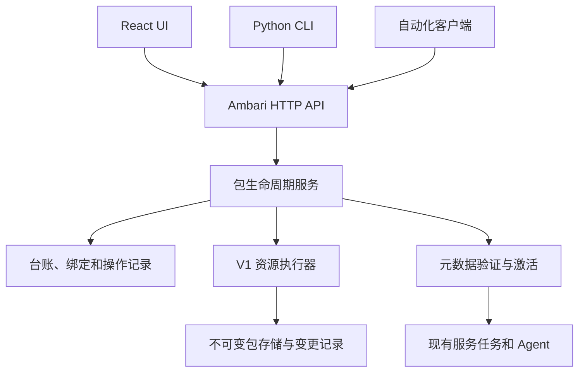

<!---
   Licensed to the Apache Software Foundation (ASF) under one or more
   contributor license agreements.  See the NOTICE file distributed with
   this work for additional information regarding copyright ownership.
   The ASF licenses this file to You under the Apache License, Version 2.0
   (the "License"); you may not use this file except in compliance with
   the License.  You may obtain a copy of the License at

       http://www.apache.org/licenses/LICENSE-2.0

   Unless required by applicable law or agreed to in writing, software
   distributed under the License is distributed on an "AS IS" BASIS,
   WITHOUT WARRANTIES OR CONDITIONS OF ANY KIND, either express or implied.
   See the License for the specific language governing permissions and
   limitations under the License.
--->

# Management Pack V1 演进方案

[English version](design.md)

新会话验收请从 [README.md](README.md) 开始，按照
[验收手册](acceptance-runbook.md)执行，并在
[验收结果表](acceptance-results.md)记录实际证据。本设计不代表运行时验收已通过。

日期：2026-09-17

状态：已按用户要求冻结交付范围，完成源码实施、最终 Java/React 编译和针对性回归。
实部署验收和提交尚未完成。实际交付证据记录于
[交付基线对照表](delivery-baseline.md)，已实现的接口记录于
[HTTP 契约](http-api.md)。针对性测试通过不等同于发布验收完成。

第 1、3、4、7、8 节定义范围、职责和行为；第 2 节提供源码依据；第 10、11 节的 API
名称和目录结构属于参考布局；第 13 节将设计对应到验收覆盖。每条规则在其负责章节
中统一维护，其他章节引用，不为同一策略增加相互竞争的描述。

## 1. 方向与目标

继承并优化 V1，而不是替换它。保留 management pack 的灵活性、`mpack.json` 的
artifact 模型、stack、extension、继承机制和现有服务管理框架，通过 HTTP 客户端、
UI 和 CLI 共用的一套生命周期服务改善使用体验。

最终方案既要支持包括 HDFS 在内的完整 Hadoop 服务，也要支持部署在裸金属主机上的
普通软件。服务打包后，不能丢失它作为 Ambari 内置服务时拥有的能力。

主要目标如下：

1. 支持将单个服务、多个服务或完整平台打包。
2. 通过 HTTP、UI 或调用同一 HTTP API 的 CLI 安装、更新、绑定、解绑和卸载 mpack。
3. 使用独立 Git 仓库维护第三方 mpack。
4. 使用 Python 工具构建单包、指定包、发布清单中的全部包，或 profile 指定的包集合。
5. 将多个独立包汇总成一个 bundle 上传，安装后仍然独立管理。
6. 部署普通软件时不要求存在 Hadoop 服务或 Hadoop stack。
7. 新增普通软件主要通过包定义完成，而不是修改 Ambari 核心。
8. 通过明确且有版本的契约扩展现有软件管理能力的不足。

历史包的特殊行为、旧 CLI 参数兼容、历史安装的自动接管和 replay 日志迁移不属于
交付要求。因此可以收紧校验并修正行为，但不能删除 V1 已有的有效能力，也不能将
复杂服务降级为只有安装、启动、停止脚本的简单封装。

本方案保留 `mpack.json`，取代此前使用全新 `mpack.yaml` 格式替换 V1 的建议。

### 1.1 已确认的架构审查决策

| 决策 | 首个版本的边界 |
| --- | --- |
| 受控激活 | 新增定义和未被引用的定义更新可以在线生效；在用定义更新走维护流程，必要时重启 Server |
| 保留 V1 能力 | 保留四类 artifact 和完整服务资源；不引入新的工作流 DSL；暂缓任意前端插件及推荐求解器 |
| 简单的用户体验 | 一个命令或一次向导完成上传、检查、安装和符合条件的绑定；持久化计划、资源归属、摘要及恢复作为内部保证 |
| 尽早验证端到端路径 | 阶段 1 在不依赖 Hadoop 的 GENERIC 环境部署 Nginx，并验证 HDFS 的加载、Agent 分发和执行 |
| 绑定范围 | 首期共享 stack/version 的集群共享有效定义；不提供集群独立选择同名服务定义版本的能力 |
| 发布单位 | 以包含精确包、绑定、继承依赖和执行资源的定义集合快照进行候选验证与受控发布 |
| 执行资源 | 任务创建时固定定义集合及资源引用；调度、重试和 Agent 恢复不能改用当前版本 |
| GENERIC 语义 | 基础运行契约与各服务的软件源、目标软件版本分别管理，不模拟统一 Hadoop 发行版 |
| Artifact 内部模型 | 保留四类 V1 输入，统一转换为资源贡献清单及变更计划，不保留四套生命周期 |
| 软件扩展边界 | 普通操作由包表达；需要新跨主机决策的流程通过明确的 Server 处理逻辑交付 |

首个版本不承诺对任意在用服务定义进行零停机热替换。受控更新、卸载、bundle 和恢复
仍然是首个完整版本的必需能力，不能为了方便演示安装而将它们后置。

### 1.2 架构决策准则

每项设计都应根据当前需求及以下准则评估：

- 每项业务决策和持久化状态都只有一个权威责任方，组件间职责与契约明确。
- 优先选择能够完成所需端到端行为的最小设计。只有具体使用场景足以证明维护成本
  合理时，才引入框架。
- 保留 V1 有价值的能力，复用 Ambari 中可靠的机制。必要时重构薄弱实现，不将维持
  其内部结构视为兼容义务。
- 在宣称操作成功前，明确失败、并发、激活和恢复边界，并通过结构化观测与可执行
  验收用例验证。
- 常用操作保持简单，高级行为明确表达，尽量减少 schema、依赖逻辑和服务语义的
  重复实现。
- 冻结抽象前验证简单服务与复杂服务路径。根据运行和维护效果评价设计，不以是否
  接近历史实现的内部结构或扩展点数量作为标准。

### 1.3 范围与不变量

本项目完善 V1 的包交付与生命周期管理，复用 Ambari 服务定义、配置、任务和 Agent
执行体系。不改造服务实例身份模型，不引入同一组件在同机上的独立多实例。单机和
分布式服务继续通过现有组件模型表达，软件自己的选主和复制协议仍由软件负责。

以下条件必须始终成立：

- 所有受管理定义、绑定和激活状态的修改，都经过同一个生命周期应用服务及并发检查。
- 未验证的候选不能成为实际生效的定义集合。
- 文件写入、执行器退出码或 HTTP 应答都不能单独证明操作成功。
- 任务不能静默切换到其他包版本的脚本。
- 活动引用或恢复所需的资源不能被垃圾回收。
- 持久化状态与实际资源冲突时必须核对，不能假定预期操作已经成功。
- 操作受理后，由服务端独立负责推进和恢复，不依赖提交它的客户端。

### 1.4 本次交付范围冻结

2026-09-22 用户批准修正实施：将 `ambari-mpacks`（mpackstore）整体构建为 bundle，
导入时只校验、存储和登记，不执行包 hook；随后在 UI 选择服务和部署目标。维护限制
根据实际变更定义、共享资源及其消费者确定，不长期阻止整个 Server 的普通写操作。
保留单一发布协调者；无关服务和管理操作继续执行。发布、取消和 hook 恢复必须保留
一致的已验证视图，并在完成边界前保留持久化归属。已有组件类别变化需要受支持的
迁移，不能当作在线属性刷新。这些决策取代此前的全局任务排空及仅存储安装语义。
不引入在线商店服务或新的工作流引擎。

2026-09-17 根据用户要求收敛实施，不再增加框架。本次交付边界是 HTTP 主导的
安装、更新、绑定、解绑、卸载及恢复闭环、CLI 和 React 客户端、不可变执行资源，
以及 GENERIC 裸金属部署路径。保留现有服务定义和 HDFS 能力，不改成简化服务格式。
剩余工作只包括缺陷修复、针对性回归、最终编译、提交和文档核对。

本次不新增自动垃圾回收、总存储配额调度、在线协调备份服务、新的非驻留进程示例、
状态遥测协议或生成式 API 客户端。保留受管理归档、快照和 Agent 缓存，避免删除
仍被引用的资源；继续限制单归档大小并检查计划有效期。运维需要监控磁盘容量。
离线备份必须停止 Server，并从同一停机状态复制数据库和完整受管理存储；不支持
局部恢复或仅备份在线文件系统。

上述边界取代第 8.6、8.7 节中自动清理和备份系统的实施范围，不改变第 1.3 节的
安全不变量。文档必须公开未完成的部署验收和验证失败，不能用源码检查宣称功能
对等。按照用户要求，冻结范围内的实现完成后才统一编译。

## 2. 分析基线

源码分析期间已核对远程 trunk 分支头：

| 分支 | 提交 | 提交日期 |
| --- | --- | --- |
| `trunk` | `116be946fb5f911236db70861631eb4ed95792cc` | 2026-09-14 |

本节结论来自源码检查。该次分析没有运行构建、自动化测试或实际 Ambari 部署，不能将
这些结论当作运行时验收证据。

### 2.1 当前 V1 与已有 Java API

trunk 中存在两条不同的 management pack 实现路径：

| 路径 | 已有行为 | 主要缺口 |
| --- | --- | --- |
| Python V1 CLI | 压缩包安装、四类 artifact、hooks、更新、卸载、资源链接和 replay 记录 | 缺少统一持久化台账、事务式激活、完整引用保护和 HTTP 集成 |
| Java `/mpacks` | REST 资源、数据库记录、元数据下载、模块解包和生成 stack 的集成 | 使用 `definition` 和 `modules`，没有提供 V1 压缩包的完整生命周期 |

主要入口包括
[setupMpacks.py](../../ambari-server/src/main/python/ambari_server/setupMpacks.py)、
[MpacksService.java](../../ambari-server/src/main/java/org/apache/ambari/server/api/services/MpacksService.java)、
[MpackResourceProvider.java](../../ambari-server/src/main/java/org/apache/ambari/server/controller/internal/MpackResourceProvider.java)
和 [MpackManager.java](../../ambari-server/src/main/java/org/apache/ambari/server/mpack/MpackManager.java)。

主要发现：

- V1 升级会先安装新版本，并在升级后 hook 完成之前删除旧版本。后续 hook 失败时，
  无法可靠地恢复到旧安装状态。
- Python 卸载路径删除暂存内容和链接，但缺少完整、权威的使用关系模型。Java 删除
  路径则只要存在任何集群就拒绝删除，即使选中的包没有被使用。
- 文件部署、数据库登记和已加载元数据没有共用一个持久化操作及经过验证的完成条件。
- 校验需要收紧。例如，`max_ambari_version` 不兼容时没有设置失败标记；未知 artifact
  类型只被报告，没有阻止安装。
- `AmbariManagementControllerImpl.updateStacks()` 会重新初始化元数据。这是一个
  接入点，还不是原子化的候选验证和激活机制。
- extension link 关联的是 stack 名称和版本。一次变更可能影响多个使用该 stack 的
  集群；UI 位于某个集群内，并不意味着底层绑定只作用于该集群。
- StackManager 构造过程不仅登记数据库，还会自动创建 extension link。仅收口
  extension-link HTTP 接口不能消除这条隐式绑定路径。
- ActionScheduler 在任务调度时注入当前资源摘要；Agent 缓存按资源目录寻址。
  摘要校验本身不能保证排队任务继续执行创建时的资源版本。
- 服务创建依赖 RepositoryVersionEntity，并通过它定位 stack 与服务定义。
  GENERIC 必须明确这层映射，增加一个基础 stack 包不会自动解耦软件版本。
- React 主机分配代码存在自动加入 `ZOOKEEPER_SERVER` 的路径。通用软件部署需要
  审查并修正此类假设。

补充源码参考：

- [AmbariManagementControllerImpl.java](../../ambari-server/src/main/java/org/apache/ambari/server/controller/AmbariManagementControllerImpl.java)
- [AmbariMetaInfo.java](../../ambari-server/src/main/java/org/apache/ambari/server/api/services/AmbariMetaInfo.java)
- [ExtensionHelper.java](../../ambari-server/src/main/java/org/apache/ambari/server/stack/ExtensionHelper.java)
- [StackManager.java](../../ambari-server/src/main/java/org/apache/ambari/server/stack/StackManager.java)
- [ActionScheduler.java](../../ambari-server/src/main/java/org/apache/ambari/server/actionmanager/ActionScheduler.java)
- [ServiceResourceProvider.java](../../ambari-server/src/main/java/org/apache/ambari/server/controller/internal/ServiceResourceProvider.java)
- [ServiceImpl.java](../../ambari-server/src/main/java/org/apache/ambari/server/state/ServiceImpl.java)
- [AssignMasters.tsx](../../ambari-web/latest/src/components/AssignMasters.tsx)

### 2.2 需要保留的 V1 能力

| 能力 | 演进方式 |
| --- | --- |
| `mpack.json` 和 `artifacts` | 保留，增加明确的 schema 和严格校验 |
| 四类 artifact | 保留表达能力，统一计划、资源归属和执行 |
| `metainfo.xml`、配置和 Python 服务脚本 | 继续使用现有服务框架 |
| stack、common-services、extension 和继承 | 保留，明确依赖解析和绑定关系 |
| advisor、Kerberos、告警、指标和 quicklinks | 纳入资源管理和验收覆盖范围 |
| 正确的安装和资源映射逻辑 | 提炼可复用逻辑，增加结构化观测及恢复 |
| hooks | 保留有用的扩展能力，明确执行阶段和恢复边界 |
| CLI 直接修改文件系统及 replay 驱动的恢复 | 替换为 HTTP 操作和持久化生命周期记录 |

## 3. 产品语义

保留三个独立概念：

| 层次 | 管理对象 | 示例 |
| --- | --- | --- |
| 包生命周期 | Server 上的定义、脚本和资源 | 安装或更新 HDFS mpack |
| 定义绑定 | 与目标 stack/version 的关联 | 为 BIGTOP 或 GENERIC 启用扩展 |
| 软件生命周期 | 主机上的软件、配置和数据 | 部署 HDFS、启用 HA 或升级 PostgreSQL |

UI 可以将安装和绑定合并成便捷的向导，但每个结果必须能够独立观测。包更新不能
隐式升级主机软件，删除包也不能隐式删除业务数据。

同时支持具有统一发布生命周期的多服务包，以及由多个独立版本包组成的 bundle。
二者是不同的编写和维护方式，都有实际价值。

## 4. 架构与职责



### 4.1 服务端生命周期服务

Java Server 负责权限、权威台账、依赖与引用检查、业务变更计划、操作调度、恢复决策、
元数据激活和 HTTP 响应。复用现有 Ambari 持久化及服务基础设施，演进已有包台账，
避免维护两套互不关联的包目录。

已有 Java 注册路径必须收敛到这个服务。旧 URI 注册语义不是兼容要求。

所有影响受管理定义、绑定或激活状态的写路径都必须使用这个应用服务，包括现有
extension-link 接口和内部调用方。将这些接口转调到统一服务，或拒绝不支持的变更；
只在新 mpack 接口上增加检查是不够的。例如，当前的
[ExtensionLinkResourceProvider](../../ambari-server/src/main/java/org/apache/ambari/server/controller/internal/ExtensionLinkResourceProvider.java)
可以直接修改绑定并触发元数据 reload。

在这一边界统一鉴权、归属检查、修订验证、变更顺序和操作记录。可以保留多个 HTTP
资源，但其底层服务不能绕过边界或独立发布同一变更。适用时复用现有绑定持久化，
不要再维护另一张权威绑定表并进行双向同步。

统一入口不意味着把所有实现放入一个类。应用服务协调计划、台账、资源执行和元数据
发布；解析器负责现有继承语义，执行器负责确定的资源操作。各职责通过明确输入和
结构化结果协作，业务决策仍由 Java Server 统一负责。

### 4.2 内部 V1 资源执行器

复用 Python V1 的资源处理语义。执行器的职责限定为归档检查、
资源及 Agent 归档准备、确定的文件系统变更、变更验证，以及受管理目录内由服务端
指示的补偿操作。不能调用旧 CLI 再解析面向人的输出。

执行器接收服务端授权的计划，不独立解析业务依赖，不决定包能否更新或卸载，不调度
恢复，也不修改生命周期数据库。它返回的资源回执描述实际观测到的变更，供服务端
核对。Python 中不能再存在第二个业务计划器或生命周期状态机。

本次资源实现位于 Java 的 `MpackArchiveStore`、`MpackResources` 和
`MpackSnapshots`，直接复用 Server 生命周期，不另设 Python 执行器或 worker RPC。
内部输入使用第 5 节的统一资源计划，不沿用四类 artifact 各自修改活动目录的旧
工作流。Python 保留为包创作工具、HTTP 客户端以及现有 Agent 服务执行语言。

内部协议必须验证 schema 版本、操作 ID、输入摘要、计划标识、资源清单和结果类型。
进程退出码或诊断日志不能单独证明业务成功。结果缺失、格式错误、过期或属于其他
操作时，必须保持失败或明确的未决状态。

### 4.3 仅通过 HTTP 管理的 CLI

所有远程生命周期操作都调用 HTTP API。CLI 不得写入 Server 资源、访问数据库，
也不能在 HTTP 不可用时回退为本地安装。模板生成、静态校验和归档构建仍属于本地
开发操作。

Ambari 必须在没有集群和用户包时就能启动并开放包管理。首次使用流程是先启动
Server，再通过 API、UI 或 CLI 上传，不要求提供离线安装路径。

## 5. Manifest 与 Artifact 演进

保留 V1 的四类 artifact：

| Artifact | 用途 |
| --- | --- |
| `stack-definitions` | 完整 stack、平台基础及相关资源 |
| `service-definitions` | 可复用的服务定义 |
| `extension-definitions` | 可关联到 stack 的服务集合 |
| `stack-addon-service-definitions` | 向声明的目标 stack 增加服务 |

新第三方软件默认推荐使用 extension。完整平台包和复杂服务仍然能够使用完整的
stack 与资源模型。

提供普通服务、服务集合和完整 stack 三类编写模板，由模板选择合适的 artifact，
不要求每个作者在制作第一个包前就理解全部四类模型。高级作者仍可使用完整模型。

四类 artifact 是外部输入格式，内部统一生成资源贡献清单，并由生命周期服务生成
变更计划。每项贡献包含提供者及包摘要、artifact 来源、逻辑资源身份、内容摘要、
声明作用范围和依赖；解析后的计划补充目标位置、受影响上下文、预期旧引用及变更
动作。文件路径不能代替服务、配置类型或共享资源的逻辑身份。

统一模型覆盖 stack、common-services、extension、addon 和共享资源。根级 advisor、
hooks、dashboard 等必须声明其实际作用范围，不能默认属于某个集群。继承贡献按
现有 Java 解析器合并并保留来源关系；不能把合法继承当作冲突，也不能把无声明的
提供者覆盖当作继承。不同 artifact 间的冲突、归属和卸载使用同一套检查。

Python 构建器和执行器不另行解析有效服务模型，也不自行决定绑定。贡献清单是从
原始定义生成并核对的内部表示，不要求包作者维护第二份服务定义。

增加明确的 manifest schema 版本及以下可选字段：

- 展示信息、分类、文档和维护者。
- Ambari、OS、架构和运行环境要求。
- 包依赖、条件要求和冲突。
- 提供的服务、能力和共享运行资源。
- 绑定约束、更新规则和重启要求。
- hook 阶段、超时、重试行为和补偿属性。

能够从现有服务资源中得到的组件或配置定义，不在 manifest 中重复维护。生成的索引
必须与这些资源核对，不能成为第二份权威定义。

分别记录包版本、服务定义版本和已部署软件版本。首期使用有文档说明的 V1 数字版本
规范，并使 Java 与 Python 的比较规则一致。不能按字符串字典序比较任意软件版本，
也不能根据版本名称推断升级兼容性。

Ambari 核心负责维护和发布 manifest schema 及客户端契约。构建工具依赖该契约的
固定版本，不向每个包仓库人工复制 schema。本地校验用于提前反馈，兼容性和
生命周期决策仍以服务端为准。

阶段 0 起草 schema 字段和 API 形态，通过初期 Nginx 与 HDFS 路径验证，再在首次
发布前以契约样例冻结公开接口。没有证明必要性的扩展字段不提前冻结。明确包、服务、
软件和发布者的标识规则，不将租户模型作为前置条件。

### 5.1 初始契约细节

初始解析器要求整数 `schema_version: 1`，保留 `type: "full-release"`、`name`、
`version` 和 `artifacts`。未知字段、重复 JSON 键、尾随 JSON 值、未知 artifact
类型和重叠的 artifact 来源目录均拒绝。标识使用 ASCII 字母、数字、下划线和连字符，
以字母开头。数字版本包含一至五个无前导零的十进制分量；比较时补零，发布身份及
精确依赖选择仍保留完整版本字符串。软件实际版本观测不受此管理定义版本规范限制。

包依赖指定名称及精确 `version`，或包含边界的 `min_version`/`max_version`，可再
通过小写 SHA-256 `digest` 固定内容；解析结果仍必须唯一。保留 V1 的
`min_stack_versions` 前置要求及 addon 的 `service_versions_map` 目标映射。
Hooks 显式声明 `timeout_seconds`（1 至 3600）和布尔值 `idempotent`；声明本身
不能授权重放结果未决的外部副作用。跨语言契约样例和端到端验收通过前，这些细节
仍属于草案。

上传使用 gzip tar，manifest 位于根目录或唯一一层包含目录。路径为规范化的相对
POSIX 路径；内部链接解析后必须仍在归档内，拒绝循环、越界、重复条目、设备文件
及不支持的稀疏条目。默认限制为压缩大小 256 MiB、展开大小 1 GiB、100,000 个条目
及 1 MiB manifest。归档身份为上传字节的 SHA-256。校验和资源计划完成前，准备
内容保持隔离；上传不代表激活。

## 6. 完整服务能力与 HDFS

HDFS 从第一阶段起就是设计约束，不能在模型完成后才将它作为可选演示。

BIGTOP 3.4 stack 继承自 3.3，3.3 又继承自 3.2。HDFS 脚本还使用 stack 执行上下文。
HA、JournalNode 管理、Federation 和 RBF 除了服务资源，还涉及前端和服务端工作流。
因此，仅复制最新的 `services/HDFS` 目录是不够的。

相关依据：

- [BIGTOP 3.4 metainfo](../../ambari-server/src/main/resources/stacks/BIGTOP/3.4.0/metainfo.xml)
- [HDFS 基础服务定义](../../ambari-server/src/main/resources/stacks/BIGTOP/3.2.0/services/HDFS/metainfo.xml)
- [HDFS 执行参数](../../ambari-server/src/main/resources/stacks/BIGTOP/3.2.0/services/HDFS/package/scripts/params_linux.py)
- [Stack 继承处理](../../ambari-server/src/main/java/org/apache/ambari/server/stack/StackModule.java)
- [Classic 服务操作](../../ambari-web/classic/app/views/main/service/item.js)

构建和导入过程必须区分包内资源、明确的包依赖以及所需 Ambari 平台能力。初期保留
资源层次和声明的继承关系，不要求每个包都将有效定义展开为扁平结构。生成的归档
不能隐式依赖源码检出目录，也不能依赖 Server 上某个无关目录一直存在。

继承、删除标记、advisor 行为和配置合并，以 Ambari 现有 stack/service 解析器为准。
不能在 Python 构建器里实现另一套 StackManager。如果需要导出解析后的结果，应复用
现有解析器，或提供由它支撑的专用导出接口。构建器负责收集声明的内容和依赖，
不另行定义一套服务语义。

HDFS 能力矩阵必须包含：

| 领域 | 必须覆盖的内容 |
| --- | --- |
| 组件 | NameNode、DataNode、JournalNode、ZKFC、Router、客户端、数量和部署位置约束 |
| 生命周期 | 安装、配置、启动、停止、状态、重启、服务检查和自定义命令 |
| 配置 | 版本、配置组、推荐、校验、主题和敏感属性 |
| 运维 | 已有扩缩容、退役、迁移和 Rebalance 能力 |
| 安全 | Kerberos、身份、权限和相关插件集成 |
| 可观测性 | 指标、告警、检查和 quicklinks |
| 高级流程 | HA、JournalNode 管理、Federation、RBF、前置条件和恢复 |
| 升级 | 已有升级定义、配置迁移、执行顺序和版本选择 |
| 依赖 | 共享代码、运行上下文、软件源和条件服务依赖 |

已有高级流程可以继续在 Ambari 核心中实现。包声明自己的要求，并关联受支持的实现。
不能因为安装了一个包，就声称它提供了平台实际不具备的工作流。

验收应在相同服务版本、等价部署条件下比较能力。服务来源变为 mpack 后，能力不能
减少。已有缺陷单独记录；静态文件存在或路由名称相同不能证明行为一致。

首个 HDFS 参考包应从固定版本的源码定义可重复地导出。本项目不会立即移除 trunk
内置 HDFS，也不会人工维护两份相同实现。在验证第一个 Nginx 路径时，同步验证
HDFS 的加载、Agent 资源分发和基础执行。随后完成 HA、Federation 的完整验收，
但其资源和能力要求必须在冻结契约之前明确。

## 7. 标识、资源归属、依赖与绑定

每个已安装版本都记录精确的包标识及归档摘要、归属资源、提供的服务、解析后的依赖、
绑定和使用关系。

采用三个核心逻辑对象，并明确各自的权威职责：

| 对象 | 权威内容 | 边界 |
| --- | --- | --- |
| 包版本 | 名称、版本、摘要和归属资源清单 | 发布内容不可变；存储或校验完成不等于激活，也不等于主机软件已安装 |
| 绑定 | 目标范围、期望版本、经过验证的实际生效版本及修订标识 | 记录该上下文中的期望状态和实际生效状态 |
| 操作 | 调用方意图、目标范围、精确输入、计划与修订、步骤、结果和恢复信息 | 负责一次生命周期变更的持久化历史及完成结果 |

这是逻辑职责划分，不要求新增三张表。应映射到合适的已有持久化机制，避免重复的
权威来源。计划快照和执行回执归属于相应操作。上传和预览计划可以具有有限保留期，
但不需要各自建立业务工作流引擎。能力和使用情况是查询视图，不是独立状态机。

是否在用、能否卸载、能否更新，根据当前引用和约束计算。避免额外持久化可能与
底层绑定、操作相矛盾的布尔状态。即使之前 UI 响应允许操作，执行变更时仍需重新
检查这些条件。

规则如下：

- 发布版本内容不可变。同名同版本但摘要不同属于冲突；内容相同可幂等处理。
- 包不能通过 force 参数静默覆盖其他包的资源。
- 将依赖解析到精确版本，并持久化解析结果。
- 区分定义依赖和运行时服务依赖。
- 条件依赖随所选能力生效，例如 HDFS HA 配置所需的 ZooKeeper。
- 拒绝缺失依赖、循环依赖、不支持的目标和不明确的服务提供者。
- 共享 stack/version 决定实际绑定范围。计划必须列出所有受影响的集群和服务，
  包括继承关系产生的影响。
- 首期不提供共享同一 stack 上下文的集群独立选择同名服务定义版本的能力。

资源归属模型必须支持精确解绑和卸载，并防止删除仍被运行中或可恢复操作引用的资源。

### 7.1 内置定义与替换

发行版提供的定义，包括内置 HDFS，必须具有可识别的提供者和资源归属。它们不是
新安装包可以覆盖的无主文件。即使不进行历史 mpack 安装的自动迁移，也必须登记
当前内置资源。

普通安装发现服务或资源定义冲突时应拒绝，并报告双方提供者及受影响目标。有意替换
属于显式操作，需要引用检查、明确范围、旧内容保留和恢复条件。在替换路径完成实现
并通过验证前，API 必须拒绝这类操作；force 参数不能代替替换流程。HDFS 参考验证
可以使用隔离目标，不必静默替换发行版定义。

### 7.2 限定范围的依赖解析

首个版本从上传归档、已安装提供者和锁定的发布清单中解析明确要求，执行版本约束、
缺失提供者、冲突和循环检查。不自动跨多个目录搜索最优组合，也不选择用户没有要求
的最新版本。解析结果不唯一时必须明确选择。运行时要求复用已有服务依赖语义，
不再引入一套并行的通用服务依赖框架。

校验必须覆盖所提议变更的影响方向：

| 变更 | 必需依赖检查 |
| --- | --- |
| 安装或绑定 | 检查目标上下文中的所需提供者及精确解析版本 |
| 更新或替换 | 检查受影响的消费者和绑定，包括不在本次上传 bundle 中的对象 |
| 解绑或卸载 | 检查来自包、绑定、服务和操作的反向引用 |
| Bundle 变更 | 检查组合变更集合，以及该集合之外受影响的消费者 |

例如，替换共享提供者不能破坏仍要求其旧版本的已启用消费者。只有实际资源布局
支持时，保留旧版本才能继续满足引用。仅存储一个尚未生效的新版本，不应强制迁移
现有消费者。根据实际激活或删除计划评估影响，并在执行时重新检查依赖图。这是
限定范围的依赖图校验，不是推荐系统或最优版本求解器。

### 7.3 绑定上下文与定义集合快照

首期绑定上下文固定为 stack 名称和版本。API 的目标必须明确标识该上下文；集群 ID
可用于选择和展示影响，但不能缩小实际变更范围。例如，两个集群都使用 GENERIC/1.0，
则它们共享该上下文的 extension 定义，不能分别激活同名服务的不同定义版本。
独立安装多个包版本不改变这个限制；任务保留旧资源也不构成集群级版本隔离。

未来如果需要集群独立选择定义，必须另行演进上下文标识、加载器查询、服务对象和
任务生成契约，不能仅给绑定增加 cluster_id，也不能用批量复制 stack 版本隐式替代。

一次发布使用不可变的定义集合快照。快照记录唯一标识、内容摘要、解析契约版本、
精确包提供者、绑定修订、继承依赖闭包、有效资源来源，以及 Agent 归档路径和摘要。
共享资源变化必须包含其影响的所有上下文；快照可引用不变的已有内容，不要求复制
整个资源树。

快照是操作的版本化输入和发布证据，不是第四套业务工作流。绑定的期望与已验证
生效记录引用对应快照；任务也引用该快照。持久化生效记录是最近一次验证的结果，
Server 重启后必须重新加载并核对，不能仅凭该记录宣称当前运行时已经就绪。

## 8. 生命周期、激活与恢复

### 8.1 通用操作流程

```text
接收归档
  -> 校验并解析依赖
  -> 创建变更计划
  -> 执行前重新核对当前状态
  -> 暂存资源
  -> 准备 Agent 归档和摘要
  -> 应用变更
  -> 验证并激活元数据
  -> 核对权威结果
  -> 完成或进入明确的恢复状态
```

计划包含受影响的资源、绑定、服务、集群、依赖、必要维护条件、重启要求和补偿限制。
每个计划关联状态修订标识及精确的包摘要。计划过期时应拒绝执行，不能继续对已经
变化的环境应用旧计划。

首期串行执行会修改共享包资源或元数据的操作。上传和只读校验可以并发。部署及其他
服务操作必须遵守相同的定义变更边界。

每类操作都具有明确的输入、前置条件和完成契约：

| 操作 | 必需输入与前置条件 | 经过验证的完成条件 |
| --- | --- | --- |
| 安装，可同时绑定 | 已验证的归档摘要、解析后的提供者、已授权目标和无冲突计划 | 版本资源已登记且可用；请求的绑定已验证生效 |
| 更新或替换 | 精确的新旧版本、目标修订、反向依赖检查和必要维护条件 | 目标绑定及运行资源与受理版本一致，恢复引用仍有效 |
| 解绑或卸载 | 精确目标标识与修订，且无阻塞引用 | 请求的绑定或归属资源已移除，元数据已验证；主机软件和数据不受影响 |

客户端默认可以组合安装与绑定，但受理意图必须固定完成范围。已暂存且等待重启的
更新，不等于激活完成。卸载也不意味着可以在保留策略和引用检查允许之前，删除
保留用于恢复的归档。

### 8.2 状态与完成条件

通过第 7 节的权威对象，区分已安装但未绑定、新版本已暂存但旧版本仍在使用，以及
操作失败或需要恢复等情况。分别报告期望版本和经过验证的实际生效版本，不能将
这些观测合并成一个“已安装”标志。

HTTP 应答表示请求已受理，不代表操作完成。激活成功需要确认同一操作和同一代次下
的目标资源清单及已加载元数据。UI 和 CLI 读取这些结构化记录。

返回操作受理结果前，持久化完整执行意图、精确输入标识、目标范围、前置条件及
幂等标识。只有已受理且持久化的工作才允许执行。重启后，服务端必须能发现并恢复
这些工作，包括队列投递或 HTTP 响应丢失的情况。不能依赖浏览器或 CLI 后续逐步
请求，才能触发每一个业务阶段。

受理后，由服务端推进操作，或记录明确的等待、失败、需要恢复状态。已受理的维护
策略可能要求用户介入，但提交连接丢失本身不是要求介入的理由。客户端超时既不代表
取消，也不能证明失败。

启动时的状态核对比较持久化操作步骤、精确的文件系统资源和已加载元数据，不能盲目
重新执行所有 hooks，也不能通过旧控制台输出推断状态。

### 8.3 更新与卸载

新版本验证完成之前保留旧资源。防止不兼容变更、并发服务操作和共享 stack 上下文的
失控更新破坏正在使用的定义。

首个版本的激活策略如下：

| 变更 | 默认处理 |
| --- | --- |
| 新增无冲突的服务定义 | 验证后在线激活 |
| 更新未被引用的定义 | 验证后在线激活 |
| 更新正在使用的定义 | 对受影响上下文执行受控维护流程 |
| 改变在用组件的类别、数量约束、版本声明或组件集合 | 在有明确且受支持的迁移前拒绝；单纯重启不足以保证正确 |
| 升级主机软件 | 独立的服务升级操作 |

对于在用定义变更，先识别全部受影响集群，限制新的冲突操作，并在切换定义前处理
排队和运行中的任务。刷新受影响的运行时对象，或明确要求重启；仅替换元数据文件
并不够。维护流程不意味着每次更新都必须停止被管理软件，但实际中断要求必须在
执行前告知。任意零停机热更新不属于首个版本的范围。

卸载时检查具体的依赖包、绑定、服务和操作，返回结构化的阻塞原因，不能因为存在
任何集群就拒绝所有删除。移除主机软件和业务数据仍然是独立、显式的操作。

### 8.4 元数据与 Hooks

导入 mpackstore 只校验、存储和登记可选定义，不执行安装 hook。ENABLE 对新启用的
提供者执行安装 hook；移除未激活的导入不执行卸载 hook。在线执行要求显式声明
`scope: "DEFINITIONS"`；省略或声明为 `SERVER` 的包仍可导入，但不能在线执行该
hook。这是作者声明的副作用范围，不是进程沙箱，不能因范围未知而静默扩大为全局维护。

取消操作先记录取消意图和发起管理员，再恢复保留的视图。通知或提交失败后继续恢复
取消，不恢复原安装。核对时也持久化已确认的失败且无副作用回执，使符合条件的重试
和取消可继续执行，而不是要求把失败伪装为成功。

利用现有元数据 reload 接入点实现候选验证和受控发布。将 StackManager 的读取与
继承合并、无持久化副作用的校验、正式登记与发布拆开。候选解析只读取明确的资源
和绑定快照，不查询不断变化的活动目录来补全缺失输入，也不写业务数据库或活动
资源。有效继承语义继续由现有 Java 解析器负责。

候选解析也隔离服务检查注册，不执行远程软件源发现；二者是当前 StackContext
中的副作用。声明的软件源输入属于快照，可选发现不能静默改变候选。服务检查元数据
只在激活边界内正式发布。

现有 autolink 转化为计划阶段可展示、可授权的绑定意图，不再由构造器或 reload
隐式创建。候选检查、启动加载和普通读取都不能自动改变绑定。未选择的兼容目标
不能因为包声明 autolink 而被静默加入操作。

协调已加载元数据、已有 service/component 对象保留的属性、advisor 和 Agent 资源
引用。候选激活失败时保留此前有效状态。需要重启的变更，在启动验证成功之前不能
报告为已生效。

资源发布属于激活流程的一部分，不能当作之后再处理的打包细节：

```text
服务与共享资源
  -> Agent 归档与可信摘要
  -> 匹配的元数据和任务引用
  -> 验证后的激活
```

复用现有资源分发路径，包括
[resourceFilesKeeper.py](../../ambari-server/src/main/python/ambari_server/resourceFilesKeeper.py)、
[ResourceManager](../../ambari-server/src/main/java/org/apache/ambari/server/resources/ResourceManager.java)
和 [FileCache](../../ambari-agent/src/main/python/ambari_agent/FileCache.py)。它们的
`archive.zip` 和摘要契约必须与已发布定义保持一致，不另建 Agent 分发服务。

首期采用任务创建时固定资源引用的方案。任务受理持久化时记录定义集合标识，以及
服务脚本、共享 hooks 和其他执行资源的不可变路径与可信摘要。调度、重试和故障后
恢复必须使用这些引用；改造 ActionScheduler 调度时注入当前摘要的行为，不能用
最新摘要覆盖已经固定的引用。需要改变输入时创建明确关联的新操作，不修改旧任务。

Server 分发地址和 Agent 缓存均按不可变资源版本寻址，支持被引用版本共存。仅在
数据库保留旧摘要、仍覆盖相同 archive.zip 或缓存目录，不满足此契约。复用现有
传输与摘要验证机制，扩展其寻址和保留策略。任务集合固定后仍需按第 8.3 节协调
服务配置及组件模型变化，版本化脚本不代表任意旧任务都可与新定义并行执行。

状态检查等没有普通 task ID 的入口，在生成执行请求时同样固定资源集合及可核对的
执行标识；不能在 Agent 执行时解析“最新版本”。Agent 离线后恢复仍核对原引用。
禁用缓存自动更新时，缺失或不匹配的版本必须明确失败，不能回退到其他缓存。资源
引用覆盖排队、运行、可重试操作和后台执行；释放后才允许按保留策略清理。定义激活
和主机执行成功仍然是不同的观测结果。

检查和计划阶段不执行包内脚本。Hooks 只在已授权的执行阶段运行。不保证任意外部
副作用都能撤销。对于非幂等或结果未决的 hook 副作用，需要明确的恢复处理，不能
自动重放。

初始 hook 回执包含 `schema_version`、`operation_id`、`plan_digest`、
`archive_digest`、`phase`、`attempt`、`state`、`effect_state` 和 `observations`。
执行器通过 `AMBARI_MPACK_*` 环境变量提供精确标识及回执路径。诊断输出不能作为
回执；完成要求 `state: APPLIED`、已知副作用状态，以及包内验证逻辑提供的结构化
观测。回执缺失、格式错误或属于其他操作时，进程正常退出也不能成为成功。

显式重试失败项仅支持声明为幂等、且有效回执同时为 `FAILED` 与 `NOT_APPLIED` 的
hook。保留旧尝试历史，增加尝试标识并使用新回执路径，不重跑已完成 hook。
`recover` 核对现有回执与原操作及尝试的关联，不能将没有观测的外部副作用变成成功。
安全取消要求已观测 hook 副作用均为 `NOT_APPLIED`，并报告实际保留的有效定义集合，
包括此前已经完成的发布。

### 8.5 Bundle 操作

bundle 操作具有父操作标识和各包独立结果。应用变更前校验所选包的完整依赖集合。
尽可能在激活前暂存内容，但不承诺对整个 bundle 中任意 hook 副作用进行原子回滚。

部分失败时必须区分已完成、失败、被阻塞和可恢复的子操作。重试保留操作关联关系，
不重复执行已完成的非幂等工作。

当前依赖和资源状态允许时，提供“重试失败项”操作。默认保留已成功的包，不因另一项
失败就卸载它们。重试剩余操作前重新校验。

初期实现暂存选定 bundle 的依赖闭包，并发布组合定义快照。每个请求的包具有由父
操作、精确发布身份及归档摘要确定的稳定成员标识。成员结果由已受理计划、已提交
发布和各包 hook 回执计算，不新增可独立修改的状态标志。没有经过验证的发布时，
不能仅因 hook 返回就报告成员成功。发布后另一项 hook 失败时，保留成功成员，
分别展示失败、未决和被阻塞的成员。

### 8.6 启动恢复与提交边界

仅通过 HTTP 管理，要求坏候选包不能破坏用于修复它的 Server。未验证内容不能进入
正式启动加载的定义集合。保留最近一次经过验证的集合及其资源，在加载受管理定义前
协调中断操作，并隔离失败候选，不能丢弃有效环境。

数据库事务、文件系统重命名和运行时发布并不是一个原子事务。必须对每个边界规定
持久化意图、步骤回执、提交顺序和验证方式。首期发布顺序如下：

1. 持久化已受理操作和输入；在隔离位置准备不可变资源、归档及定义集合快照，完成
   无持久化副作用的候选校验。此前的生效集合不变。
2. 对受影响上下文及共享资源建立变更屏障，阻止冲突变更和新任务生成；重新核对
   修订、引用及维护条件，并协调已有任务与后台执行。无法满足条件时等待或失败。
3. 在数据库事务中记录待发布快照、预期旧快照、操作 ID 和发布代次，并登记必要
   元数据。期望记录可以前进，已验证生效记录仍指向旧集合；待发布内容不能通过
   查询被解释为已生效。需要重启时保留屏障及等待状态，由启动恢复继续此协议。
4. 在屏障内发布运行时定义、对应 advisor 与资源引用，并刷新已有 service/component
   对象；核对操作、代次、快照及资源摘要。定义读取和执行入口不能观察到混合代次，
   无法安全刷新时要求重启或拒绝转换。
5. 核对成功后以修订检查提交生效快照及发布结果，再释放屏障。操作完成还必须满足
   已受理意图中的其他步骤；后续 hook 失败不能抹去已经实际生效的发布事实。

屏障是生命周期操作的并发控制，不是另一套持久化状态机。重启时从未完成操作重建
屏障，再开放受影响的变更和执行入口。第 3 步后崩溃不能直接认定候选已生效；第 4
步后回执丢失时核对实际资源及发布记录，重新加载同一候选或经验证可恢复的旧集合，
不重复执行未知结果的 hook。恢复和补偿同样记录操作、代次及实际结果，不倒改历史。
包管理查询与受支持的恢复 API 应在受影响服务执行被阻止时仍然可用。

各类失败的处理要求：

| 失败位置 | 必需行为 |
| --- | --- |
| 上传或校验 | 保持实际生效环境不变，允许修正后重新上传 |
| 资源准备 | 当前定义继续生效，明确可以清理的暂存内容 |
| 资源已变更但结果尚未登记 | 依据持久化意图和回执核对精确资源，不能盲目重复应用 |
| 激活 | 尽可能保持或恢复此前验证过的定义，报告实际恢复结果 |
| 完成响应丢失 | 通过幂等标识找到原操作，不再安装一次 |
| 外部 hook 结果未知 | 保留未决恢复状态，不能通过重跑 hook 猜测结果 |

如果无法恢复到一致且经过验证的状态，应明确报告并遵循有文档说明的恢复程序，
不能报告成功。CLI 不增加隐藏的本地安装回退。本次只支持由运维协调的离线备份：
从同一 Server 停机状态保存数据库、完整受管理存储和激活记录，并一起恢复；启动时
仍需核对持久化快照与资源身份。自动或在线协调备份恢复服务不在本次范围内。

不同恢复范围必须明确区分：

| 范围 | 恢复契约 |
| --- | --- |
| 包资源与绑定 | 依据操作清单和修订检查，只恢复本次操作拥有的变更 |
| 服务配置 | 使用精确配置版本和前置条件，不覆盖本次操作之后发生的修改 |
| 主机软件或业务数据 | 通过显式服务操作及其受支持的恢复契约处理 |
| 未决外部副作用 | 保留观测到的不确定性，提供必要的恢复操作入口 |

换回旧包目录不能证明完整回滚。更新后被其他操作写入的配置，不能直接用旧快照
覆盖。检测到修订冲突时，应保留已记录意图和当前状态，停止盲目补偿。如果旧定义
无法安全使用当前配置，应保持待恢复状态，而不是报告环境已经还原。

### 8.7 存储、权限与保留策略

动态包内容和暂存数据放在明确受管理、且 Ambari Server 服务账号可写的目录中。
在线操作不要求通用 root 执行权限，也不递归修改发行版管理的资源树属主。Server
hooks 的允许路径和执行身份需单独定义，与 Agent 服务命令区分。

限制单归档压缩大小、解压大小和成员数，受理时拒绝过期计划。本次保留上传、计划、
发布资源、快照和 Agent 缓存，不提供自动过期删除、总存储配额或垃圾回收。
卸载只退役定义，不删除恢复字节或主机数据。运维必须监控磁盘可用空间，不得在
Server 运行期间手动删除受管理资源。

后续若实现垃圾回收，必须检查活动绑定、任务引用、未完成操作和恢复保留要求。
删除缓存归档不能移除当前生效或刚被替换定义的唯一恢复副本。这是后续清理的安全
契约，不代表本次已经交付自动清理。

## 9. 通用软件部署与扩展能力

将 `GENERIC` 基础 stack 作为普通 V1 mpack 发布，不继承 Hadoop 要求。提供真实
部署所需的运行环境、软件源、advisor 和安装元数据，不能只放一个空 stack 目录。

既支持已有 BIGTOP 环境中的兼容扩展，也支持 GENERIC 环境中的独立第三方部署。
服务选择、主机分配、软件源、配置和 Agent 上下文遵循声明的要求。复杂 Hadoop 包
保留其更完整的运行环境。

GENERIC 的 stack 版本表示基础运行契约，包括公共配置、默认 advisor 和 Agent
上下文要求，不表示 Nginx、PostgreSQL 等软件组成的统一发行版。更新基础包不会
隐式改变已部署软件版本，也不为每一种软件版本创建一个新的 GENERIC stack 版本。

| 层次 | 权威含义 |
| --- | --- |
| GENERIC stack 版本 | 基础运行契约及兼容边界 |
| Mpack 版本与定义集合 | 管理定义、脚本及其精确组合 |
| 服务的软件交付选择 | 目标软件版本、OS/架构、软件源及包要求 |
| 主机软件观测 | 由对应服务或包管理器的类型化结果确认的实际安装版本 |

服务创建当前依赖 RepositoryVersionEntity，并通过其 stack 身份定位定义。首期
保留这个兼容接入点，明确服务交付选择到 repository 记录的映射，不把 repository
版本字符串自动当作 GENERIC 版本或所有软件的共同版本。优先使用现有服务级关联；
如果现有校验、唯一约束或升级路径无法支持独立选择，必须在阶段 1 记录缺口，增加
最小必要适配后再冻结契约，不能仅通过伪造一个统一发行版本绕过。

当前软件源校验要求 repository 版本以 stack 版本开头。增加 stack 级
`repositoryVersionMode`，继承后的默认值为兼容旧行为的 `DISTRIBUTION`，GENERIC
等基础环境声明 `INDEPENDENT`。后者只放宽发行版前缀检查，仍校验 OS、软件源身份、
权限和明确的服务级软件源选择。Repository 记录标识所选交付来源与版本，不证明
主机上实际安装的版本；接受独立软件源版本也不意味着服务支持滚动 stack 升级。

复用 AmbariMetaInfo 根据 stack 和 repoinfo 生成默认版本定义，不另设基础环境注册
机制。没有服务声明发行版版本时，默认 VDF 可以具有空升级清单，stack-service
列表仍展示普通软件。初始化软件源定义中的基础版本，不代表软件目标版本或主机
已安装软件版本。

每个服务的交付选择明确软件源、包和目标版本，并复用已有元数据及 OS 包管理器。
不在 manifest 中重复软件源权威配置。同一 GENERIC 上下文允许不同服务各自选择
受支持的软件版本，但定义仍遵循第 7.3 节的共享范围；不同软件版本只能使用所选
定义明确支持的路径。未实现独立升级契约时必须报告不支持，不能冒充 stack 升级。

普通服务不要求安装 stack-select 或 Hadoop，也不能依赖缺失参数时回退为 BIGTOP。
不使用 stack-select 的服务通过明确的结构化观测报告版本；缺失结果保持未知或失败，
不能用 GENERIC、mpack 或 repository 的版本代替实际软件版本。

现有 Agent hooks 路径为全局配置，默认 hooks 会执行 Hadoop 和 Java 初始化。在
stack 的 `metainfo.xml` 增加可选 `hooksFolder`：省略时继承父 stack，仍未指定时
沿用服务端现有配置；空值表示禁用 stack hooks；非空值为资源根目录下的规范化
相对路径。GENERIC 显式禁用这些 hooks，并将选定路径随定义快照发布和固定，
不通过硬编码 stack 名称选择 hooks。该扩展补足现有执行参数，不新增工作流语言。

### 9.1 复用现有服务语义

增加能力字段或格式前，先检查 `metainfo.xml`、custom command、advisor 或现有
升级描述是否已经能够表达。统一读取和校验这些定义，不要求作者维护另一份可能
与其语义冲突的能力 manifest。仅为已经证明的缺口新增字段，并为每项事实确定
唯一权威来源。

保留已有服务能力，仅在具体服务证明存在共同需要时引入新的通用契约。下表描述
扩展边界，不要求在首个版本中实现所有通用框架：

| 扩展点 | 必需契约 | 首个版本的处理方式 |
| --- | --- | --- |
| 自定义操作 | 输入、权限、前置条件、超时、幂等性、执行和结构化结果 | 复用 custom command，按需增加参数描述和简单表单 |
| 健康检查 | 存活、就绪或业务检查，以及明确的结果 schema | 复用服务检查和告警，为示例服务定义具体观测结果 |
| 运维工作流 | 有序步骤、任务关联、检查点、重试和补偿边界 | 复用现有服务脚本、受支持的处理逻辑及任务机制，不引入新的工作流 DSL |
| 软件升级 | 支持路径、迁移、停止条件、验证和回退限制 | 保留现有升级描述和执行机制 |
| 数据操作 | 备份、恢复、清理分别具有独立语义和权限 | 保持显式服务操作，暂缓通用数据操作框架 |
| UI 能力 | 表单、操作入口、结果展示和受支持的高级流程绑定 | 支持简单声明式表单及已有处理逻辑，暂缓任意前端插件 |

复用现有 Request/Stage/Task 和 Agent 机制，不另建主机任务执行平台。通用操作根据
声明的 schema 渲染；已有复杂流程初期关联核心中受支持的处理逻辑。manifest 声明
不意味着可以执行任意前端代码。

“新增普通软件主要修改包”适用于现有执行机制能够表达的能力，不承诺任意复杂操作
都能仅通过包交付。实现边界如下：

| 能力 | 实现责任 |
| --- | --- |
| 安装、配置、启停和单机自定义操作 | 包内元数据及服务脚本，使用现有 Agent 执行 |
| 已有升级机制能够表达的有序操作 | 现有升级描述及执行机制，验证其适用条件 |
| 新的跨主机决策、协调与恢复规则 | 明确的 Server 处理逻辑，使用现有任务基础设施；必要的核心改动单独交付 |

Request/Stage/Task 提供执行基础设施，不自动提供服务的业务语义。HDFS 已有高级
处理逻辑不能证明新软件的主从切换也已受支持。新增处理逻辑必须定义输入、权限、
前置条件、任务关联和恢复观测；包只能关联已受支持的实现，未知实现必须拒绝。

首期选择 PostgreSQL 单实例的显式备份及在隔离验收环境中恢复作为有状态参考，不
覆盖原实例数据，也不扩展同一集群的服务实例身份模型。验收备份身份、源实例关联、
恢复目标、服务观测和失败重试，验证包脚本与现有任务机制的边界；不因此宣称支持
跨主机自动故障切换或通用备份框架。

不为 mpack 服务新增通用工作流 DSL、解释器或工作流引擎。这是整个项目的架构边界，
也适用于后续交付阶段，不是仅从首个版本中暂缓的功能。已有复杂服务已经证明，
脚本、现有升级描述、受支持的处理逻辑和 Request/Stage/Task 能够表达丰富行为。
复用这些机制，必要时提炼职责明确的辅助函数。包作者不需要学习新的编排语言，
已有服务和升级格式也不需要重写。

目录推荐算法、跨目录最优版本选择和通用前端插件运行时留待后续。公共抽象在成为
新框架前，至少应有两个具体服务使用场景证明其必要性。限制框架范围并不意味着
从能力一致性验收中删去任何已有 HDFS 高级工作流。

同名服务的多个独立实例需要另外设计身份、配置和依赖模型，不能在本项目中通过
增加一个 manifest 字段就宣称实现。

### 9.2 没有常驻进程的软件

包可以提供常驻服务、客户端、命令行工具或库。新增类型前，优先使用现有组件分类，
包括适用的 client-only 行为。安装和版本检查不能要求虚构一个运行中的进程或
守护进程健康状态。

UI 只展示受支持操作，服务端执行相同限制。没有对应语义的组件不提供启动、停止；
服务没有安全实现时，不提供通用缩容操作。多种部署模式的布局和校验由已有元数据
及 advisor 表达，需要迁移的模式转换不能视为普通配置编辑。

声明软件交付要求，复用现有 Agent 和系统包管理机制，不另行实现 RPM/APT 依赖
求解器。定义移除、主机软件移除和数据清理仍然遵循第 3 节，保持为不同操作，
库和共享工具也不例外。

## 10. HTTP API 与客户端体验

### 10.1 拟议 API 资源

所有资源位于 `/api/v1` 下。最终方法、字段、权限、错误码和并发行为必须通过
[HTTP 契约](http-api.md)记录；冻结的交付范围不另设 OpenAPI 或客户端生成项目。

| 资源 | 职责 |
| --- | --- |
| `mpack_uploads` | 上传归档、摘要和检查信息 |
| `mpack_plans` | 经过验证的安装、更新、绑定和卸载计划 |
| `mpack_operations` | 执行、进度、结果和受支持的恢复操作 |
| `mpacks` | 统一的已安装包及版本台账 |
| `mpack_bindings` | 明确的目标环境关联 |
| `mpacks/{id}/usages` | 依赖、绑定和卸载阻塞信息 |
| `mpack_capabilities` | 支持的 schema 版本、artifact、操作及平台能力 |

长操作返回 HTTP 202 和操作 ID。支持幂等键及稳定的机器可读错误码。即使客户端
已经做过本地检查，API 仍负责校验和鉴权。

明确幂等键的调用方与操作作用域。相同键及相同规范化请求返回原操作；相同键但
输入或目标不同，返回结构化冲突。在调度变更前持久化这项关联，返回结果时重新
检查权限。归档摘要相同不意味着操作相同：将其绑定到另一个目标属于不同意图。

客户端在提交不兼容操作之前查询受支持能力，并给出可操作的错误提示。能力响应
本身也是权威契约，不能根据 Server 版本字符串或 UI 上是否恰好有某个控件推断支持
情况。

资源分层用于支持实现和自动化，不要求普通用户手动创建 upload、plan 和 binding。
默认客户端流程合并这些阶段，为有需要的用户保留高级 dry-run 和显式计划入口。
如果执行前的状态变化使预览失效，应解释影响变化，并仅在影响用户选择时要求重新
决定；不能静默扩大目标范围并执行。

### 10.2 CLI

提供可安装的 CLI，暂定名 `ambari-mpack`。管理员不需要检出第三方仓库就能管理
Server。HTTP 客户端和本地编写工具以可复用 Python 模块提供，并按照核心契约发布。
仓库内的 `tools/mpack.py` 可以是方便使用的薄封装，不能成为独立实现。

命令示例，本地构建命令在包仓库中运行：

```bash
# Local authoring and building
ambari-mpack scaffold nginx
ambari-mpack validate ./mpacks/nginx
ambari-mpack build --all
ambari-mpack build --packs nginx,postgresql --bundle infrastructure

# Remote management through HTTP only
ambari-mpack install dist/infrastructure.bundle.tar.gz
ambari-mpack install dist/nginx-1.0.0.0.tar.gz --dry-run
ambari-mpack list
ambari-mpack show nginx
ambari-mpack update nginx --file dist/nginx-1.1.0.0.tar.gz
ambari-mpack uninstall nginx
ambari-mpack operations show <operation-id>
```

CLI 上传内容，按需请求服务端生成预览，提交已确认的意图，并查询对应操作。
业务计划、执行和恢复按照第 8.2 节由服务端负责，CLI 不是业务调度器。默认等待
完成，支持 `--no-wait`、`--json`、连接配置，以及连接中断后的恢复查询。在破坏性
操作前解决包或版本选择的歧义。

停止 CLI 等待、关闭 UI 页面或客户端超时，都不意味着取消 Server 上的操作。
应返回或保留操作 ID 用于核对。只有服务端声明安全的步骤才允许显式取消，并报告
取消结果。响应丢失后的重试使用相同幂等标识，不能盲目创建一次新安装。

凭据不能进入源码仓库、归档内容或日志。客户端实现作为可复用 Python 模块提供，
不要在多个发布脚本中重复编写 HTTP 逻辑。

### 10.3 React UI

提供全局扩展包入口，在创建集群前也能访问：

- 可搜索的台账，包含分类、版本、兼容性和使用情况。
- 支持整体导入 mpackstore 或单包，再从目录选择服务。
- 变更前展示依赖和影响预览。
- 安装、更新、绑定、解绑和卸载流程。
- 持久化操作进度、结构化错误和受支持的恢复入口。
- 刷新页面或开启新浏览器会话后，继续查询同一操作。
- 安装并绑定后跳转到已有部署向导。

默认流程是整体导入、选择服务和兼容部署目标、自动检查、必要的影响确认、启用定义，
再进入已有的新建集群或添加服务向导。导入不执行 hook，也不在主机部署软件。
未选择的服务仍保留在目录中；多服务包保持独立包身份，但只部署用户选定的服务。
基础包和共享资源作为依赖处理，不伪装成可以启停的服务。
只有一个合格目标时预选该目标；存在多个目标或冲突时要求选择。不能静默绑定到
所有兼容环境。如果目标 stack 被多个集群共享，修改在用定义前必须展示完整影响
范围。

提供高级计划和绑定详情，但不将它们变成所有用户的必经步骤。bundle 展示各项结果，
并允许重试符合条件的失败项。错误信息应说明阻塞原因和下一步动作，不能只暴露
内部状态名或异常文本。

明确拒绝的提交应清除过期提交记录并允许重新预览；结果未明的提交保留原计划和
幂等标识，在可访问的界面中提供核对入口，不能锁住预览弹窗。部署衔接保留精确的
操作、服务目录标识和目标环境，刷新后不能换成另一个集群或选中包中的全部服务。

首期通过服务端权限限制，只有 Ambari 管理员可修改包。校验归档路径、链接、大小和
摘要。后续若增加远程下载功能，需要明确的来源策略。

实现相关 React 行为前，检查对应 Classic 代码和 Ember 基线。将有意差异及回归覆盖
记录到当前 React 证据中。相关临时基线包括安装、stack 管理、服务配置、NameNode/
JournalNode HA 和 Federation。本设计文档不属于自动生成的迁移证据。

## 11. 第三方仓库与构建工具

在以下位置创建独立本地仓库：

```text
/Users/jialiang/PRJS/ambari-mpacks
```

拟议目录结构：

```text
ambari-mpacks/
  README.md
  LICENSE
  NOTICE
  tooling.lock
  tools/
    mpack.py                 # optional wrapper around the released tooling
  profiles/
  shared/
  mpacks/
    generic-base/
    nginx/
    postgresql/
  reference/
    hdfs/
  tests/
  dist/
```

每个软件包独立维护 manifest、服务定义、支持矩阵和使用文档。共享运行文件在构建
时装入包内，或通过明确依赖提供，不能运行时读取开发检出目录。

`tooling.lock` 用于表示固定的工具和契约依赖，具体格式属于实现选择。使用 Ambari
核心发布的 schema，不在这里人工维护另一份 `schemas/`。该仓库也不能成为用户
CLI 的唯一分发渠道。

保留独立 Git 历史。确定远程仓库后，可通过 submodule 挂载到
`contrib/third-party-mpacks`。Ambari 核心构建不要求检出所有第三方包。创建或推送
远程仓库不属于当前仅编写文档的步骤。

Python 工具提供模板生成、静态校验、限定范围的依赖选择、版本锁定、确定性归档、
校验和、来源信息、profile、bundle、目录索引生成和 HTTP 发布。构建期检查不重复
实现 Ambari 的运行时继承和激活语义。`--all` 指选定发布清单中的全部包，不是全部
历史版本。

bundle 示例：

```text
infrastructure.bundle.tar.gz
  bundle.json
  mpacks/
    generic-base-1.0.0.0.tar.gz
    nginx-1.0.0.0.tar.gz
    postgresql-1.0.0.0.tar.gz
```

`bundle.json` 带有版本，记录各成员的精确路径、名称、版本和摘要。导入时将索引与
各归档核对。bundle 是传输容器，不能变成妨碍各包独立更新的合成大包。

默认发布管理定义和脚本。完全离线的软件二进制可通过单独定义的 payload 能力支持，
并明确来源信息和大小语义。

## 12. 交付计划

| 阶段 | 交付内容 | 完成条件 |
| --- | --- | --- |
| 0：范围与契约草案 | V1 能力清单与能力矩阵、manifest/API 草案、绑定与快照模型、发布恢复时序、GENERIC 版本契约 | 明确共享上下文边界、资源归属、发布顺序、软件源映射和 HDFS 资源要求 |
| 1：初期端到端路径 | 最小生命周期、统一资源计划、HTTP 客户端、GENERIC 基础包和 Nginx/HDFS 参考包 | 从无集群环境经 HTTP 导入并在无 Hadoop 依赖的 GENERIC 上部署 Nginx；验证 HDFS 基础执行、快照加载和不可变 Agent 资源引用 |
| 2：完整生命周期 | 台账、受控更新、卸载、替换边界和崩溃后的状态核对 | 必需生命周期操作形成可恢复路径，验证资源归属及任务与资源的一致性 |
| 3：仓库 | Python 工具、bundle、GENERIC 打包完善和示例包 | 指定包或发布清单中的全部包可构建、上传并独立管理；验证 PostgreSQL 备份恢复参考路径 |
| 4：部署与 UI | 通用部署适配和 React 管理 | API、CLI、UI 行为一致，非 Hadoop 环境可以部署软件 |
| 5：复杂服务验收 | HDFS 参考包和高级能力集成 | 包来源变化不导致现有受支持服务行为丢失 |
| 6：后续生态工作 | 目录订阅、更多软件和经过实际需求验证的公共扩展 | 普通新增软件主要修改包仓库；新框架需要具体共同场景支持 |

HDFS 分析从阶段 0 开始，阶段 1 就验证基础执行。GENERIC 和无 Hadoop 的 Nginx
部署也在阶段 1 验证，不能仅用 BIGTOP 上的扩展代替。阶段 3 的 PostgreSQL 有状态
操作及服务独立软件版本选择共同验证扩展契约。取得相关证据后，在首次发布前
使用契约样例冻结稳定公开接口。阶段 5 是完整复杂服务验收，不是首次测试 HDFS
加载或资源分发。通过阶段 1 只是中间里程碑，不能据此从首个完整版本中删去更新、
卸载、bundle、UI 或恢复。首个完整版本要求完成阶段 0 至 5。

围绕引擎、生命周期、API/CLI、仓库工具、UI 和复杂服务集成，组织内聚的 JIRA 交付
以及可审查的主题提交。针对性测试与所验证行为一同提交。数据库变更必须覆盖
受支持的数据库后端和 Ambari 升级路径。

## 13. 验证与验收

使用互补的能力类别作为验收参考。软件示例用于检验共享架构，不为每个示例增加
新的核心子系统：

| 参考对象 | 用途 |
| --- | --- |
| Nginx | 基础安装、配置、reload 和健康检查 |
| PostgreSQL | 有状态操作、持久化目录、数据保护和版本约束 |
| HDFS | 复杂组件、条件依赖、安全、高级工作流和升级 |
| 没有常驻进程的客户端、工具或库 | 安装、版本与依赖检查、受支持操作的可见性，以及无守护进程生命周期的移除 |

架构决策对应以下必需证据：

| 决策 | 验收证据 |
| --- | --- |
| 统一变更边界 | 新 API、现有 extension-link 接口和内部调用都不能绕过归属、并发和操作记录 |
| 最小权威模型 | 期望与实际生效版本可以区分；操作资格查询与引用一致，并在执行时复查 |
| 服务端接管已受理操作 | 客户端断开和 Server 重启后仍能执行、恢复；响应丢失时找到原操作 |
| 反向依赖保护 | 更新和 bundle 考虑提交集合之外受影响的消费者 |
| 明确恢复范围 | 不覆盖后续配置修改；补偿失败不能报告完整回滚 |
| 现有服务语义 | 现有定义保持权威，不要求重复的能力格式或新的工作流语言 |
| 非守护进程支持 | UI 和 API 不虚构不受支持的进程操作或运行状态 |
| 共享定义上下文 | 两个共享 stack/version 的集群显示完整影响范围，拒绝集群专属定义版本选择 |
| 定义集合发布 | 候选校验与 autolink 无持久化副作用；按快照、操作和代次验证发布及崩溃恢复 |
| 固定执行资源 | 更新后调度及重试仍使用原资源；新任务使用新快照，Agent 可保留被引用的两个版本 |
| GENERIC 版本契约 | 无 Hadoop 的初始部署，服务独立软件源及版本选择，实际版本不由基础包版本推断 |
| 统一资源贡献 | 四类 artifact 跨类型冲突、合法继承、共享 advisor 归属及精确卸载使用同一模型 |
| 软件扩展边界 | PostgreSQL 备份恢复验证身份、数据保护及失败恢复；未实现的高级流程明确拒绝 |

必须覆盖以下验证：

- 所有受管理写路径都进入同一生命周期边界，包括现有绑定接口和内部调用。
- 期望与实际生效版本展示、派生操作资格在执行前过期，以及依据权威引用重新校验。
- 同名同版本不同内容、相同请求重试、缺失或循环依赖、不支持的环境和资源冲突。
- 上传 bundle 之外的反向依赖、共享提供者更新，以及保留提供者版本时的安全共存
  或拒绝行为。
- 内置服务与包提供服务的冲突、显式替换的拒绝或执行，以及旧定义资源归属的保留。
- 提交后连接丢失、执行期间 Server 重启、元数据激活失败、hook 失败和补偿不完整。
- 调度投递丢失或客户端断开后，已持久化的受理工作仍可恢复；幂等键重放覆盖相同
  请求和内容冲突的请求。
- 配置发生后续修改时的恢复，以及定义回滚与主机软件、数据恢复的明确区分。
- 候选验证不产生持久化副作用、启动时出现无效候选、恢复最后有效状态，以及协调的
  备份与恢复。
- 在第 8.6 节每个发布边界注入崩溃，包括运行时已发布但生效回执未提交；核对屏障
  恢复、快照及代次，不出现新旧定义混合或候选自动绑定。
- 卸载在用包、共享 stack 的影响，以及主机任务与定义变更并发。
- 受控在用更新和需要重启的行为，包括刷新已有 service/component 对象，以及向
  用户明确展示中断范围。
- Agent 归档与摘要发布、排队任务的版本标识、禁用缓存自动更新、Agent 不可用，
  以及被引用旧资源的保留。
- 旧任务创建后发布新包，再调度、重试及恢复旧任务；同时验证状态检查和共享 hooks
  的精确资源引用，以及保留引用时 Server 和 Agent 不清理对应版本。
- bundle 部分失败，以及保留已完成工作的重试。
- 结构化结果缺失或格式错误、诊断噪声、摘要不匹配、过期计划和其他操作的标识。
- 无集群时首次上传、GENERIC 部署，以及已有 BIGTOP 环境中的兼容扩展。
- 同一 GENERIC 上下文中不同服务使用各自软件源和版本；更新基础包不改变已安装
  软件版本，版本观测缺失时不回退到 repository 或 stack 版本。
- PostgreSQL 备份中断、备份身份缺失或不匹配、恢复目标冲突及恢复失败后的显式
  重试；通过结构化身份与数据验证确认结果，原实例数据保持完整。
- UI 刷新、权限拒绝、服务端校验和操作恢复。
- 客户端能力不匹配、单一或有歧义的目标选择、停止等待与取消的区别，以及响应丢失
  后的幂等重试。
- 服务账号文件系统权限、废弃上传过期，以及遵守绑定、任务、恢复副本和活动操作
  引用的清理。
- 在等价版本、拓扑和声明能力条件下验证 HDFS 能力一致性。
- 非守护进程组件的安装和移除、UI 与 API 对不支持操作的拒绝，以及现有 OS 包管理
  机制的复用。

测试必须使用结构化观测和权威持久化标识，不能只模拟预期消息或检查命令被调用。
通过适合对应服务的协议或类型化观测确认主机软件状态。基线缺陷、尚未验证的工作流
与打包引入的回归分别报告。

本文是交付行为基线，不是实现完成的证明。实施过程中在对应章节补清不足的契约，
并在交付对照表中关联实现和验证证据；不能为适配未完成代码而静默降低要求。最终
验收逐项比较基线要求、实际实现行为和已执行的验证结果。
